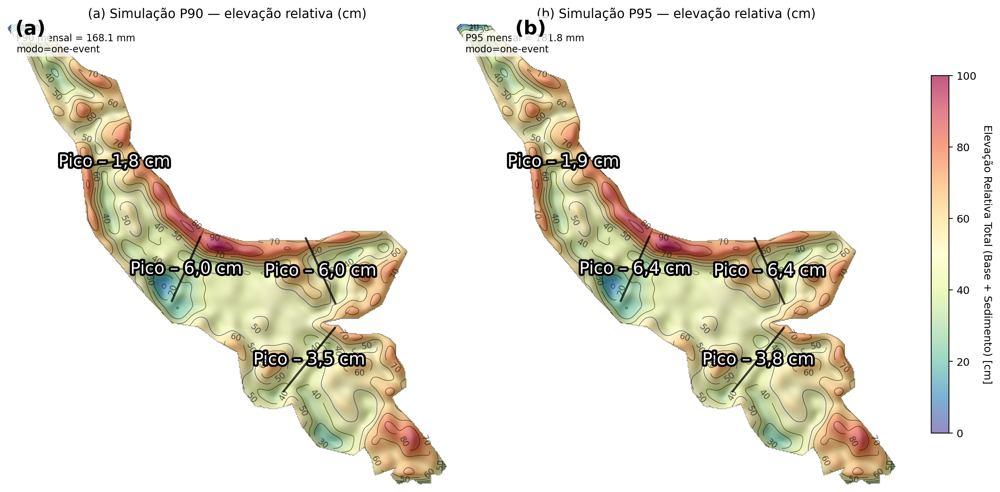

# Resumo

A incisão de ravinas em Plintossolos sob pastagem degradada constitui um desequilíbrio hidrossedimentológico crítico, exacerbado pela baixa permeabilidade do subsolo e pela alta erodibilidade dos horizontes superficiais. Este estudo avaliou a eficácia técnica de paliçadas de bambu (*Bambusa vulgaris*) dispostas em série para o controle de erosão linear e retenção de sedimentos em uma ravina experimental. O monitoramento de dois anos (2023–2025), integrado à análise de uma série pluviométrica de 20 anos (2005–2025), quantificou a evolução morfométrica e a resposta deposicional do sistema. Os resultados indicaram retenção vertical acumulada de até 76 cm nos segmentos intermediários, com estabilização geométrica da feição. A dinâmica deposicional revelou-se não linear e episódica, uma vez que quatro episódios de deposição extrema (acima do percentil 95 da deposição incremental) responderam por 40,6% da carga sólida total retida. A análise de eficiência por segmento demonstrou desempenho equilibrado, com contribuições de 37,7% (SUP), 22,6% (MED) e 39,7% (INF), e eficiências de retenção variando de $1,12$ a $1,97 \times 10^{-4}$ cm/mm. A capacidade residual após dois anos de monitoramento permanece superior a 98% em todos os segmentos, indicando uma longevidade operacional projetada em cenário base de 59 anos. Contudo, sob cenários de recorrência de meses de alta energia (P90--P95; série 2005–2025 agregada em totais mensais), essa longevidade pode sofrer redução para o intervalo de 0,8 a 4,8 anos. Conclui-se que a técnica oferece uma solução de bioengenharia robusta e de baixo custo, cuja sustentabilidade operacional depende de protocolos de manutenção estrutural periódica e gestão de volume retido para mitigar o risco de saturação rápida em anos de alta severidade climática.

**Palavras-chave:** bioengenharia de solos; conectividade hidrossedimentológica; erosão linear; Plintossolo; *check dams*.

# 1. Introdução

A degradação física de pastagens altera substancialmente a hidrologia de vertentes, reduzindo a taxa de infiltração e ampliando o coeficiente de escoamento superficial. Esse desequilíbrio hidrodinâmico eleva a tensão cisalhante do fluxo sobre a superfície; quando esta excede a resistência ao cisalhamento dos agregados do solo, desencadeia-se a incisão de feições erosivas lineares, como ravinas, que atuam como condutos preferenciais de alta energia para o transporte de sedimentos. Em Plintossolos, a presença de horizontes subsuperficiais com impedância hidráulica exacerba esse processo, favorecendo o escoamento por excesso de saturação e a instabilidade de taludes, o que demanda intervenções técnicas para o controle do fluxo concentrado.

A degradação de pastagens é um processo multifatorial que envolve a deterioração das propriedades físicas, químicas e biológicas do solo, frequentemente desencadeada por manejo inadequado e compactação excessiva [@martins_et_al_2023]. A compactação reduz a macroporosidade e aumenta a densidade do solo, diminuindo a condutividade hidráulica saturada e favorecendo a geração de escoamento superficial hortoniano mesmo em eventos de precipitação de média intensidade. Quando o escoamento superficial se concentra em linhas de fluxo preferencial, a tensão cisalhante aplicada supera a resistência coesiva do solo, iniciando o processo de incisão linear.
As ravinas representam um estágio avançado dessa dinâmica, caracterizadas por canais profundos com taludes instáveis que não permitem a transposição por máquinas agrícolas e que evoluem por mecanismos de erosão regressiva e colapso lateral de paredes [@poesen_2018]. Diferentemente de sulcos efêmeros, as ravinas alteram a conectividade hidrológica da bacia, acelerando o tempo de concentração e ampliando o pico de vazão e a produção de sedimentos.

As práticas de conservação do solo visam restabelecer o equilíbrio hidrológico e controlar a energia do escoamento. No contexto de erosão linear, as intervenções estruturais buscam reduzir a velocidade do fluxo e estabilizar o perfil longitudinal do canal. A bioengenharia de solos oferece soluções de engenharia hidráulica baseadas em materiais naturais para a dissipação de energia e estabilização de canais. As paliçadas (*check dams*) funcionam como barreiras permeáveis que alteram a geometria hidráulica do canal, reduzindo a declividade efetiva e a velocidade do fluxo, o que diminui a capacidade de transporte de sedimentos e induz a deposição a montante [@guerra_bezerra_jorge_2023].

Do ponto de vista hidráulico, as paliçadas reduzem a declividade efetiva do canal através da formação de degraus sedimentares a montante, diminuindo a tensão cisalhante no leito e prevenindo a incisão vertical [@piton_et_al_2017]. Como estruturas permeáveis, permitem a passagem do fluxo de água enquanto retêm a carga sólida grosseira, evitando a pressão hidrostática excessiva típica de barragens impermeáveis. O uso de materiais vegetais, como bambu (*Bambusa vulgaris*), introduz componentes de bioengenharia que, além da função mecânica imediata, podem favorecer o estabelecimento de vegetação e o reforço radicular do solo ao longo do tempo, combinando resistência mecânica com baixo custo e potencializando a viabilidade econômica de projetos de recuperação ambiental [@huzita_noda_kayo_2020; @birnnaum_et_al_2018].

Embora a literatura reporte o uso de estruturas de retenção e barreiras permeáveis para controle de erosão linear e de conectividade hidrossedimentológica, ainda são relativamente escassas as avaliações quantitativas com foco em desempenho em Plintossolos sob regime de precipitação tropical intensa, sobretudo quando se exige vinculação explícita entre pulsos de chuva, resposta deposicional e estabilização morfométrica em escala operacional de monitoramento [@nichols_polyakov_2019; @abbasi_et_al_2019].

Este estudo avaliou a eficiência de engenharia de um sistema de paliçadas em série no controle de erosão por ravinas, quantificando a retenção de sedimentos, a evolução morfométrica da feição e a interação com a variabilidade pluviométrica em um Plintossolo Argilúvico distrófico.

# 2. Materiais e métodos

## 2.1 Caracterização da área experimental

O experimento foi conduzido na Estação Experimental Campus Rural da Universidade Federal de Sergipe (UFS), no município de São Cristóvão--SE (10°55\'28,8\" S; 37°11\'58,9\" O, WGS 84) (Figura 1). A área apresenta relevo ondulado a muito ondulado e ocorrência de processos erosivos lineares. O clima é tropical úmido (As, segundo Köppen-Geiger), com período seco entre setembro e janeiro e estação chuvosa entre fevereiro/março e julho/agosto, e precipitação anual média reportada de 1.300 mm [@duarte_santos_castelhano_2021], enquanto a série diária 2005–2025 da estação meteorológica de Aracaju-SE utilizada na análise pluviométrica resultou em média de 1092,2 mm/ano.

{width="6.188623140857393in"
height="4.433333333333334in"}

Fonte: VIANA, A.S.S

## 2.2 Descrição morfológica do solo

A caracterização morfológica e a classificação taxonômica do solo foram realizadas de acordo com o Sistema Brasileiro de Classificação de Solos (SiBCS) [@embrapa_2018]. Para análise do perfil, abriu-se uma trincheira com aproximadamente 1,5 m de profundidade, permitindo a observação direta das características morfológicas. Descreveram-se cor, textura, estrutura e consistência, além de coleta de amostras para análises físicas e químicas, conforme [@tome_junior_1997].

{width="2.494268372703412in" height="3.2583333333333333in"}

Fonte: Autor.

Os atributos químicos e físicos obtidos para os horizontes descritos são apresentados na Tabela 1, os quais fundamentam a interpretação da impedância hidrológica do perfil e da sua resposta ao escoamento concentrado.

**Tabela 1** -- Atributos químicos e físicos do Plintossolo Argilúvico distrófico

| Atributos                         | Ap (0–10 cm) | AB (10–25 cm) | BAc (25–40 cm) | Bt (40–150+ cm) |
|----------------------------------|-------------:|--------------:|---------------:|----------------:|
| pH em água (1:2,5)               |          5,2 |           4,5 |            4,6 |             4,6 |
| P (Fósforo), mg/dm^3^            |          1,4 |           1,4 |            1,4 |             1,4 |
| K (Potássio), mg/dm^3^           |         82,1 |          17,0 |            6,5 |             5,6 |
| Al (Alumínio), cmol~c~/dm^3^     |         0,56 |           2,9 |            3,7 |             5,9 |
| T (CTC a pH 7,0), cmol~c~/dm^3^  |          5,3 |           4,1 |            4,4 |             7,9 |
| m (Saturação por Alumínio), %    |         15,2 |          89,8 |           99,2 |            84,7 |
| V (Saturação por Bases), %       |         58,4 |          14,5 |            9,5 |            13,6 |
| Areia, %                         |         51,5 |          43,6 |           43,5 |           39,65 |
| Silte, %                         |         14,9 |           8,9 |            7,5 |             8,9 |
| Argila, %                        |         33,4 |          47,4 |           49,2 |            51,4 |
| Textura                          | Franco Argilo Arenosa | Argilosa | Argilosa   |         Argilosa |

## 2.3 Levantamento planialtimétrico

O levantamento planialtimétrico da área foi realizado por aerofotogrametria, utilizando o drone Air 2S associado ao receptor GNSS RTK Emlid RS2. O sistema RTK teve como função corrigir erros de escala e localização geográfica, garantindo precisão centimétrica [@fortunato_2018].

Foram estabelecidos três pontos de apoio georreferenciados, distribuídos estrategicamente para aumentar a acurácia na representação do relevo. Com base nos dados obtidos, as feições erosivas foram identificadas e classificadas como ravinas, segundo critérios de [@thwaites_et_al_2022] e [@firoozi_firoozi_2024]. Essas feições se distinguem dos sulcos pela maior profundidade e largura, e das voçorocas pela ausência de contato com o lençol freático (Figura 3) [@lafayette_cantalice_coutinho_2011; @dey_et_al_2018].

{width="6.5in"}

## 2.4 Planejamento e construção das paliçadas

As paliçadas foram construídas com madeira da espécie *Bambusa vulgaris*, coletada na própria área experimental (Figura 4). As dimensões das estruturas foram definidas com base nos dados morfométricos das ravinas, considerando os segmentos superior, intermediário e inferior.

O espaçamento entre paliçadas foi calculado de modo que a base de cada estrutura ficasse em nível com o topo da paliçada seguinte, permitindo o acúmulo de sedimentos no desnível formado [@emater_2006; @couto_et_al_2010].

As toras de bambu foram dispostas horizontal e verticalmente, parcialmente enterradas para aumentar a resistência às enxurradas. Optou-se por adicionar 30 cm extras ao comprimento de cada tora, possibilitando o soterramento de 15 cm em cada lado da ravina (nos taludes) e de 30 cm nas toras verticais, garantindo maior estabilidade estrutural. Nos pontos previamente selecionados, abriram-se buracos de 30 cm de profundidade para fixação das toras verticais (Figura 4).

{width="6.5in"}

A tora basal foi incorporada à estrutura após permanecer enterrada por dois meses, período necessário para o desenvolvimento de brotos, desempenhando dupla função, propagação da espécie e barreira contra enxurradas. Para induzir brotamento e enraizamento, perfuraram-se os entrenós da tora basal, com preenchimento de água e posterior vedação, procedimento adotado para elevar a disponibilidade hídrica local e reduzir limitação inicial ao crescimento vegetativo. 

Em seguida, as toras horizontais foram instaladas e fixadas às verticais com arame recozido. Para aumentar a eficiência na retenção de sedimentos, foram adicionados sacos de ráfia preenchidos com solo local, ou sacos vazios fixados na face a montante das paliçadas, conforme [@nardin_et_al_2010] (Figura 5). A integridade estrutural do conjunto foi mantida por intervenções periódicas em ciclo de oito meses, com substituição de arames recozidos e renovação dos sacos de ráfia posicionados na face frontal, procedimento voltado a aumentar a retenção sem bloquear o escoamento e reduzir risco de colapso do depósito acumulado sob eventos de alta energia.

{width="6.5in"}

## 2.5 Monitoramento de erosão e sedimentação

O monitoramento da dinâmica erosiva e deposicional foi realizado pelo método dos pinos [@morgan_2005; @guerra_2005; @andrade_rocha_2014]. Foram utilizados pinos de ferro com 30 cm de comprimento, cravados a 10 cm de profundidade, deixando 20 cm expostos. As medições foram realizadas em dois pontos principais, a montante das paliçadas, para estimar a deposição de sedimentos, e na cabeceira da ravina, para mensurar perdas por erosão. As leituras foram realizadas mensalmente, durante dois anos, de acordo com a proposta metodológica de [@costa_et_al_2011].

Para complementar a análise, foram utilizados dados pluviométricos obtidos na estação meteorológica de Aracaju-SE, localizada a 15 km da área experimental, a fim de correlacionar os eventos de precipitação com as variações no movimento do solo.

Como a estação não está instalada no interior da ravina, diferenças microclimáticas locais (especialmente em eventos convectivos) podem introduzir incerteza na correspondência entre a chuva registrada e a chuva efetivamente incidente na área experimental. Por esse motivo, a precipitação foi utilizada principalmente para contextualização regional e para análise de padrões e limiares em escala mensal, e não como medida pontual exata do total precipitado sobre a feição.

Ao todo, foram construídas quatro paliçadas na ravina estudada, identificadas como P1, P2, P3 e P4 na representação espacial, utilizadas como unidades experimentais para avaliar a retenção de sedimentos. As medições foram realizadas em três segmentos distintos da ravina, superior, intermediário e inferior, permitindo uma análise detalhada da eficiência das paliçadas em diferentes condições morfométricas e hidrológicas.

## 2.6 Eventos extremos e integração temporal

Para contextualização regional da severidade das chuvas, as curvas Intensidade--Duração--Frequência (IDF) foram representadas pela forma geral $i(t,T) = \frac{K\cdot T^a}{(t + b)^c}$, em que $i$ é a intensidade (mm/h), $t$ a duração (min), e $T$ o período de retorno (anos). Adotaram-se parâmetros $K = 1200$, $a = 0{,}20$, $b = 15$ e $c = 0{,}80$ para compor o envelope de referência utilizado na comparação com os eventos do período monitorado.

Para a integração com o monitoramento de campo, as séries mensais de precipitação e sedimentação incremental foram alinhadas por data de referência do mês, viabilizando a comparação entre a forçante climática e a resposta deposicional nos segmentos superior, intermediário e inferior.

Como as leituras de campo foram mensais, a abordagem não resolve a variabilidade intra-mensal (intensidade, duração e sequência de pulsos), de modo que meses com totais semelhantes podem corresponder a regimes hidrológicos distintos e produzir respostas deposicionais diferentes.

A classificação de intensidade de eventos no período monitorado foi obtida por limiares empíricos definidos pelos quantis 0,25, 0,50, 0,75, 0,90 e 0,95 da precipitação mensal da série integrada, estruturando as classes Muito Baixo, Baixo, Moderado, Alto, Muito Alto e Extremo. Os percentis foram referidos como Pxx, por exemplo P90 para o percentil 90 e P95 para o percentil 95.

## 2.7 Análises estatísticas

As séries mensais de precipitação e sedimentação incremental foram avaliadas por correlação de Pearson [@pearson_1896], com estimativa de $r$ e significância associada, e por regressão linear simples, com $R^2$ reportado como medida de capacidade explicativa. Para verificar possível resposta defasada do sistema, também foi estimada a correlação por defasagem (lag) entre precipitação e sedimentação incremental (incremento fracionado), testando-se lags mensais em uma janela simétrica (até ±6 meses) e mantendo-se o alinhamento por data e a estratificação espacial por segmento (SUP = superior, MED = intermediário, INF = inferior). Essa análise é consistente com a ocorrência de meses em que a precipitação é elevada, mas o maior carreamento/deposição se manifesta no mês subsequente.

Para investigar não linearidade por segmento, ajustou-se um modelo polinomial de segundo grau e a comparação entre os ajustes linear e polinomial foi conduzida por teste F. Diferenças na taxa de deposição mensal entre segmentos foram avaliadas por ANOVA de um fator [@fisher_1925], sob nível de significância de 5%.

A sazonalidade foi sintetizada por trimestre do calendário a partir da soma da sedimentação incremental positiva, operacionalizada pelo incremento fracionado truncado em zero, reportando-se a participação percentual de cada trimestre no total do período monitorado. As análises foram realizadas em Python, com pandas e NumPy para estruturação dos dados, SciPy para testes e statsmodels para ajuste de modelos.

## 2.8 Representação espacial

Para organizar e comunicar os resultados em termos espaciais, os produtos do levantamento planialtimétrico e o inventário de feições erosivas foram estruturados em ambiente de Sistema de Informação Geográfica (SIG), no qual cada informação é armazenada por coordenadas e pode ser analisada por sobreposição de camadas.

## 2.9 Simulação espacial sob limiares

A simulação espacial foi usada como extrapolação controlada para transferir a leitura tempo-variável de extremos de precipitação para o recorte da ravina, preservando a ordem de grandeza observada no monitoramento e impondo restrição geométrica explícita de armazenamento a montante das paliçadas, que operam como barreiras permeáveis com redução de tensão cisalhante e deposição preferencial sob menor conectividade hidrossedimentológica [@wang_et_al_2021].

Os limiares do percentil 90 (P90) e do percentil 95 (P95), estimados da série diária 2005--2025 agregada em totais mensais, foram tratados como condições de contorno hidrológicas de meses de alta energia (distintos dos percentis Pxx calculados apenas no período monitorado na Seção 2.6). A resposta deposicional mensal foi operacionalizada pela sedimentação incremental positiva do método dos pinos, convertida para centímetros e relacionada empiricamente à precipitação por uma razão por segmento, gerando a espessura esperada para um mês sintético com precipitação igual ao limiar, em coerência com a lógica de parametrização deposicional usada em aplicações por simulação [@zema_et_al_2014]. O enquadramento por simulação foi adotado como instrumento para avaliar efeitos hidrológicos e sedimentológicos de estruturas transversais em sistemas com check dams, coerente com aplicações por modelagem de processos de sedimentação e erosão local [@xu_fu_he_2013].

Para incorporar o efeito hidrológico de condições antecedentes via infiltração, utilizou-se a Velocidade de Infiltração Básica (VIB, cm/h), estimada por segmento como a média das últimas cinco leituras do ensaio de infiltração. A VIB foi acoplada a um coeficiente efetivo de escoamento superficial ($C_r$) por uma lei de potência inversa com limites (clamping), de modo a manter valores fisicamente plausíveis e permitir calibração:

$$
C_r\;=\;\operatorname{clip}\Bigl(C_{ref}\,\bigl(\tfrac{VIB_{ref}}{VIB}\bigr)^{\alpha},\;C_{min},\;C_{max}\Bigr)
$$

em que $C_{ref}$ é o coeficiente de referência associado a $VIB_{ref}$, $\alpha$ controla a sensibilidade do acoplamento, e $\operatorname{clip}(\cdot)$ restringe o resultado ao intervalo $[C_{min},\,C_{max}]$. Para testes de sensibilidade e reprodutibilidade, $C_r$ pode ser fixado diretamente (override), substituindo o valor derivado da VIB.

Nesta aplicação, adotaram-se $VIB_{ref}=2{,}0$ cm/h, $C_{ref}=0{,}60$, $\alpha=1{,}0$, $C_{min}=0{,}20$ e $C_{max}=0{,}95$.

A parametrização do coeficiente de escoamento superficial em função da velocidade de infiltração básica fundamenta-se no princípio físico estabelecido por @horton_1933 e @horton_1940, segundo o qual o escoamento superficial é gerado quando a intensidade de precipitação excede a capacidade de infiltração do solo. Solos com maior VIB apresentam maior capacidade de absorção da água precipitada, resultando em menor geração de escoamento superficial e, consequentemente, menor coeficiente de escoamento [@foster_meyer_onstad_1977]. A modulação da sedimentação pelo coeficiente de escoamento segue a abordagem de modelos processuais como EUROSEM [@morgan_et_al_1998] e WEPP [@nearing_et_al_1989], nos quais a capacidade de transporte de sedimentos é diretamente proporcional ao volume e energia do escoamento superficial. Esse acoplamento é coerente com a formulação da USLE/RUSLE [@wischmeier_smith_1978], que estabelece relações quantitativas entre escoamento e desprendimento de sedimentos.

A espessura incremental deposicional de base para cada limiar (P90/P95) foi obtida pela tradução empírica chuva--incremento, derivada da razão média por segmento entre sedimentação incremental (incremento fracionado, cm) e precipitação mensal (mm):

$$
\Delta z_{base}(P_{xx})\;=\;\Bigl(\overline{\tfrac{\Delta z_{FRAC}}{P}}\Bigr)_{seg}\,\cdot\,P_{xx}
$$

e a modulação hidrológica foi aplicada multiplicando-se $\Delta z_{base}$ por um fator relativo de escoamento, definido pela razão entre o coeficiente efetivo e o coeficiente de referência:

$$
\Delta z_{eff}(P_{xx})\;=\;\Delta z_{base}(P_{xx})\cdot\Bigl(\tfrac{C_r}{C_{ref}}\Bigr)
$$

O recorte foi representado por um processamento do GeoTIFF da ravina. A deposição foi parametrizada como cunha a montante de cada paliçada, com decaimento longitudinal e suavização transversal, aplicando-se no cenário de evento único o pico estimado para P90 ou P95 e computando-se a espessura média pela distribuição espacial do depósito, enquanto no cenário de capacidade máxima a cunha foi preenchida até a altura útil, alinhando-se à lógica de armazenamento a montante e de quantificação de volumes retidos em estruturas de controle [@ramos_diez_et_al_2017]. O tempo até saturação foi estimado pela projeção da taxa mensal de deposição dos cenários (Médio, P90, P95) sobre o volume ou altura remanescente de cada estrutura, assumindo para fins de análise de stress a recorrência contínua do regime hidrológico testado.

# 3. Resultados e discussão

## 3.1 Desempenho estrutural das paliçadas (Caracterização edáfica e resposta funcional)

A área experimental se desenvolve sobre Plintossolo Argilúvico distrófico, com horizontes contrastantes em coloração, granulometria e consistência, e atributos físico-químicos compatíveis com a classe, destacando-se elevada acidez, presença de alumínio e baixa saturação por bases [@cassol_et_al_2023; @tome_junior_1970]. Essa condição edáfica opera como condição de contorno hidrológica e geotécnica para a dinâmica de erosão linear, uma vez que perfis com elevado teor de argila e infiltração efetiva limitada tendem a favorecer escoamento superficial, intensificar deflúvio sob escoamento concentrado e ampliar o transporte de sedimentos mobilizados de taludes para o leito [@de_oliveira_et_al_2024]. 

As interpretações apresentadas a seguir são ancoradas nesse contexto pedológico e geomorfológico específico e devem ser generalizadas com cautela para outras classes de solo e configurações de ravinas, nas quais a infiltração efetiva, a oferta de sedimento mobilizável e a conectividade hidrossedimentológica podem responder de forma distinta.

Nesse enquadramento, as paliçadas construídas com bambu demonstraram boa resistência estrutural ao longo do período monitorado, suportando eventos de enxurrada sem apresentar danos significativos. A escolha do bambu como material principal mostrou-se eficaz devido à disponibilidade local, ao baixo custo e às propriedades mecânicas favoráveis para esse tipo de aplicação [@romano_et_al_2016]. O bambu contribuiu para a estabilização local ao promover entouceramento e aporte de material orgânico, enquanto a estrutura em série dissipava a energia do escoamento. Esse processo induziu o acúmulo progressivo de sedimentos, que, ao reter umidade e matéria orgânica, funcionou como uma plataforma deposicional favorável ao estabelecimento de vegetação espontânea, reduzindo a energia disponível para destacamento de partículas [@chaturvedi_et_al_2013]. O resultado é um nivelamento parcial do leito da ravina, onde o posicionamento relativo das estruturas passa a controlar a conectividade hidrossedimentológica do trecho (Figura 6).

{width="6.5in"}

## 3.2 Dinâmica morfométrica e deposicional (Alterações dimensionais e padrões de sedimentação)

As alterações morfométricas entre 2023 e 2025 indicaram redução sistemática da altura da feição erosiva em todos os segmentos, concomitantemente ao aumento de largura associado ao recuo lateral e ao rearranjo geométrico dos taludes (Tabela 2). A transição de seção com tendência de forma em "V" para "U" é compatível com o preenchimento do fundo por deposição e com processos de instabilização lateral sob baixa cobertura vegetal, que promovem desprendimento e aporte para o leito, realimentando o balanço hidrossedimentológico [@ghosh_et_al_2022].

**Tabela 2** -- Dados morfométricos coletados em 2023 e em 2025.

| Ano  | Segmento       | Largura Sup (m) | Largura Inter (m) | Largura Inf (m) | Altura (m) |
| ---- | -------------- | --------------- | ----------------- | --------------- | ---------- |
| 2023 | Superior       | 1,8             | 1,4               | 0,17            | 0,8        |
| 2023 | Intermediário  | 3,3             | 2,1               | 0,5             | 1,5        |
| 2023 | Inferior       | 1,7             | 1,1               | 0,35            | 0,85       |
| 2025 | Superior       | 1,97            | 1,58              | 1,50            | 0,3        |
| 2025 | Intermediário  | 3,62            | 3,06              | 2,52            | 0,74       |
| 2025 | Inferior       | 2,12            | 1,62              | 1,09            | 0,49       |

O acúmulo de sedimentos e detritos a montante das paliçadas totalizou 50 cm, 76 cm e 36 cm nas estruturas superior, intermediária e inferior, respectivamente, magnitude coerente com a redução de altura observada e com a reorganização do perfil longitudinal em resposta à dissipação sequencial de energia.

## 3.3 Análise integrada tempo-variável (Relações precipitação-sedimentação e padrões temporais)

A análise da série histórica de precipitação (2005–2025) permite contextualizar o período monitorado dentro da variabilidade climática regional. A evolução mensal da chuva, destacando a recorrência de picos anuais e a estabilidade da tendência de longo prazo, é apresentada na Figura 7, o que valida a representatividade dos dados coletados durante o experimento.

{width="6.5in"}

A caracterização climática de longo prazo (2005–2025) revelou um regime pluviométrico estacionário (tendência linear não significativa, 95,59 mm/mês) mas marcado por forte sazonalidade (amplitude de 119,64 mm) e por cauda superior pronunciada, com recorrência de meses de alta precipitação. Nesse contexto, a resposta deposicional mensal monitorada (2023–2025) foi analisada em conjunto com a precipitação.

A variabilidade da deposição observada apresentou desacoplamento parcial em relação ao volume pluviométrico mensal ($r = 0,43$; $R^2 = 0,17$), comportamento que reflete a não linearidade da produção de sedimentos em ravinas. O baixo poder explicativo da chuva acumulada indica que a resposta do sistema é controlada por limiares de iniciação e pela conectividade hidrossedimentológica antecedente, e não apenas pela magnitude pluviométrica isolada [@vanmaercke_et_al_2021]. A resposta do sistema depende criticamente da conectividade hidrossedimentológica e das condições antecedentes, como a umidade do solo e a cobertura vegetal, que alteram o coeficiente de escoamento superficial independentemente da magnitude pluviométrica mensal [@keesstra_et_al_2019].

A estratificação espacial revelou heterogeneidade marcante na resposta deposicional entre os segmentos. O segmento intermediário (MED) apresentou a maior consistência de resposta ($R^2 = 0,45$; $p < 0,01$), sugerindo que este trecho atua como uma zona de transporte e deposição mais equilibrada e sensível ao volume de fluxo. Os segmentos superior (SUP) e inferior (INF) apresentaram ajustes mais fracos ($R^2 = 0,11$ e $0,10$, respectivamente). No segmento inferior, o ajuste polinomial revelou-se significativamente superior ao linear ($p < 0,05$), elevando o coeficiente de explicação para aproximadamente 0,15, o que denota a complexidade hidrodinâmica a jusante e a predominância de processos não-lineares de remanso. Essa variabilidade longitudinal é esperada em sistemas de *check dams*, nos quais a dissipação cumulativa de energia modifica o regime hidráulico e redistribui zonas de remanso e de transporte ao longo do perfil [@zema_et_al_2018].

A sazonalidade da deposição mostrou-se fortemente concentrada no primeiro semestre hidrológico. Os trimestres Q1 (jan-mar) e Q2 (abr-jun) responderam, respectivamente, por 41,99% e 29,97% do total de sedimentos retidos, totalizando cerca de 72% da deposição anual. Esse padrão coincide com a maior frequência de meses com chuva intensa no início da estação chuvosa e menor densidade de cobertura vegetal espontânea, evidenciando a janela crítica para intervenções de manejo. @lucas_borja_et_al_2021 também observaram tal dinâmica em ambientes mediterrâneos, onde a janela de perturbação no início das chuvas, combinada com solo exposto, maximiza a produção de sedimentos antes do estabelecimento pleno da biomassa vegetal.

Em termos de desempenho acumulado, a trajetória da sedimentação explicita o caráter episódico do processo: poucos meses de alta energia governam uma parcela desproporcional do estoque retido (Figura 8). A contribuição relativa por segmento no total depositado foi equilibrada (SUP: 37,7%, MED: 22,6%, INF: 39,7%), indicando que, apesar das diferenças na dinâmica de resposta instantânea, o sistema de paliçadas em série promoveu uma retenção distribuída ao longo do perfil longitudinal, atuando como desconectores eficazes da rede de drenagem [@tangi_et_al_2022]. Análise de variância (ANOVA) confirmou ausência de diferenças significativas entre segmentos ($F = 0,27$; $p = 0,77$), evidenciando a homogeneidade do desempenho ao longo do perfil longitudinal.

{width="6.5in"}

A dinâmica temporal dessa contribuição relativa é apresentada na Figura 9, que apresenta a composição percentual da sedimentação retida em cada mês monitorado. Observa-se que, embora o balanço acumulado final seja equilibrado, a dominância de cada segmento flutua em resposta à magnitude dos eventos individuais, com o segmento inferior assumindo maior preponderância em meses de precipitação extrema, enquanto os segmentos de montante (superior e intermediário) controlam a retenção em eventos de pré-saturação ou de menor energia.

{width="6.5in"}

## 3.4 Eficiência comparativa e capacidade residual das paliçadas

A análise quantitativa da eficiência de retenção por segmento revelou desempenho diferenciado ao longo do perfil longitudinal, embora estatisticamente não significativo (ANOVA, $p = 0,77$). O segmento inferior (INF) apresentou a maior eficiência de retenção específica ($1,97 \times 10^{-4}$ cm/mm), seguido pelo superior (SUP, $1,87 \times 10^{-4}$ cm/mm) e intermediário (MED, $1,12 \times 10^{-4}$ cm/mm) (Tabela 4). Essa inversão aparente em relação ao $R^2$ reportado na seção anterior reflete a distinção entre capacidade explicativa linear e eficiência de retenção por unidade de precipitação, na qual o segmento intermediário apresenta maior consistência de resposta linear, enquanto os segmentos extremos (SUP e INF) retêm mais sedimento por unidade de chuva, possivelmente associados à maior oferta de material mobilizável por colapso lateral de taludes nos trechos de cabeceira e de jusante [@poesen_2018; @vanmaercke_et_al_2021].

A sedimentação total acumulada durante o período monitorado (junho/2023 a maio/2025) totalizou 0,48 cm no segmento superior, 0,29 cm no intermediário e 0,51 cm no inferior, com variabilidade temporal expressa por coeficientes de variação de 235%, 469% e 162%, respectivamente (Tabela 4). Essa alta variabilidade temporal é característica de sistemas dominados por processos episódicos, nos quais a retenção é fortemente modulada por poucos eventos de alta magnitude [@bombino_et_al_2019]. A menor variabilidade no segmento inferior sugere maior estabilidade deposicional, possivelmente associada à zona de remanso terminal e à diminuição da competência de transporte a jusante da série de barreiras.

Espacialmente, a resposta sedimentológica mostrou-se governada por condicionantes locais distintas da pluviosidade direta, conforme evidenciado pela baixa correlação no segmento superior ($R^2 = 0,02$). A dispersão dos dados neste trecho de cabeceira sugere que a instabilização de taludes e a disponibilidade de material mobilizável sobrepõem-se à forçante climática mensal como mecanismo dominante de aporte. No segmento intermediário (MED), apesar do maior $R^2$ reportado anteriormente (0,45 quando considerada a série completa), a análise univariada simples resultou em $R^2 = 0,01$, sugerindo que a resposta é modulada por covariáveis não capturadas no modelo linear simples, tais como lag temporal e sazonalidade. O segmento inferior apresentou o melhor ajuste linear ($R^2 = 0,15$), corroborando sua função como zona de deposição preferencial e remanso terminal [@zema_et_al_2018].

**Tabela 4** -- Indicadores de retenção e variabilidade deposicional por segmento no período junho/2023 a maio/2025.

| Segmento | Contribuição no total (%) | Sedimentação acumulada (cm) | Eficiência específica (cm/mm) | Coeficiente de variação (%) |
| -------- | ------------------------: | --------------------------: | ----------------------------: | --------------------------: |
| SUP      |                      37,7 |                        0,48 |               $1,87 \times 10^{-4}$ |                         235 |
| MED      |                      22,6 |                        0,29 |               $1,12 \times 10^{-4}$ |                         469 |
| INF      |                      39,7 |                        0,51 |               $1,97 \times 10^{-4}$ |                         162 |

**Tabela 5** -- Coeficiente de determinação ($R^2$) da regressão linear simples entre precipitação mensal e sedimentação incremental, estratificada por segmento.

| Segmento | $R^2$ |
| -------- | ----: |
| SUP      |  0,02 |
| MED      |  0,01 |
| INF      |  0,15 |

O comportamento tempo-variável da sedimentação incremental ao longo do período monitorado é compatível com um regime dominado por pulsos e por remobilização intermitente, no qual meses com deposição positiva alternam com meses de perda local, sobretudo no segmento intermediário, coerente com a dinâmica de redistribuição de material em sistemas com barreiras permeáveis em série [@frankl_et_al_2021]. Essa condição é consistente com os coeficientes de variação elevados reportados por segmento, com máximo no trecho intermediário (469%), interpretável como assinatura de um compartimento de transição com alternância entre fases de transporte e de remanso sob mudanças no regime de vazão e na conectividade hidrossedimentológica ao longo do perfil [@zema_et_al_2014].

Em síntese, a eficiência específica variou de $1,12$ a $1,97 \times 10^{-4}$ cm/mm e o desempenho permaneceu sem diferenças estatisticamente significativas entre segmentos, enquanto a ocupação inferior a 2% após dois anos e os coeficientes de variação superiores a 160% reforçam que a retenção é governada por deposição episódica e que a limitação operacional tende a ser dominada pela manutenção estrutural das paliçadas, e não por saturação física do armazenamento.

## 3.5 Eventos extremos e limiares operacionais

O comportamento episódico do sistema fica mais evidente quando a deposição é lida no tempo sob a ótica de extremos, porque a operação das paliçadas como barreiras permeáveis depende simultaneamente da conectividade hidrossedimentológica a montante, da oferta de material mobilizável nos taludes e do regime de escoamento concentrado no leito. Conforme discutido por @vanmaercke_et_al_2021, a erosão em ravinas é frequentemente controlada por limiares de iniciação (*thresholds*), onde a mobilização de sedimentos não ocorre de forma contínua, mas em pulsos discretos ativados quando a tensão cisalhante supera a resistência crítica do solo.

Em termos de estoque retido, a construção progressiva da cunha deposicional a montante de cada estrutura é coerente com a magnitude de acúmulo observada em campo, com 50 cm, 76 cm e 36 cm nas paliçadas superior, intermediária e inferior, respectivamente, e com a ocorrência de janelas mensais em que a dissipação de energia em série reduz a capacidade de transporte a jusante e promove deposição preferencial no trecho imediatamente a montante, reorganizando o perfil longitudinal e contribuindo para o nivelamento observado. @zema_et_al_2014 descrevem esse processo como uma evolução assintótica em direção a um "perfil de compensação", onde a eficiência de retenção tende a diminuir conforme a cunha sedimentar preenche o volume disponível a montante da barreira.

A variabilidade temporal da precipitação, com picos concentrados no primeiro semestre do ano, governa a eficiência relativa das paliçadas ao aumentar a probabilidade de escoamento concentrado e de aporte lateral por colapso estrutural de taludes, modulando a carga sólida disponível para retenção a montante. Em Plintossolos com infiltração efetiva limitada e tendência a deflúvio superficial sob saturação, mesmo eventos de magnitude moderada podem gerar cargas sedimentares significativas quando ocorrem sobre solo desprotegido [@bertoni_lombardi_neto_2017].

Temporalmente, a correlação por defasagem entre precipitação e sedimentação incremental sustenta uma resposta atrasada do sistema, com fortalecimento da associação observado, quando a chuva antecede o incremento deposicional observado (Figura 10). Esse padrão é compatível com resultados obtidos em séries hidrossedimentológicas de diferentes escalas, tais como observados por @juez_nadalromero_2020, nas quais a carga em suspensão e o transporte efetivo podem responder com atraso à forçante pluviométrica em função de armazenamento e remobilização ao longo do canal e das encostas, assim com mudanças de fase condicionadas por disponibilidade de sedimento fino, conectividade e intensidade antecedente [@juez_et_al_2021; @zhao_et_al_2023].

No domínio da ravina, a mobilização por escoamento concentrado e por instabilização lateral nem sempre se converte em deposição no mesmo intervalo de medição, pois parte da carga sólida permanece temporariamente em estoques no leito, nos taludes e nas zonas de remanso a montante das paliçadas, sendo posteriormente redistribuída e decantada sob condições hidráulicas distintas [@vanmaercke_et_al_2021; @navarro_et_al_2021]. Como a leitura é mensal pelo método dos pinos, a integração de pulsos intra-mensais tende a deslocar a assinatura do evento para a observação subsequente quando a precipitação se concentra no fim do mês, o que reforça a interpretação de atraso como propriedade conjunta do sistema e do esquema temporal de monitoramento.

Em termos de evidência acumulada, o caráter episódico do acúmulo se manifesta por degraus mais pronunciados após meses classificados como extremos, o que indica que o ganho de estoque retido é governado por pulsos e por reorganização do depósito ao longo do perfil longitudinal (Figura 8). A literatura de conectividade e histerese em bacias hidrográficas indica que elementos desconectores e complexidade morfológica criam zonas de remanso e ampliam o tempo de residência hidráulica, promovendo deposição intermitente e não determinística, mesmo sob volumes de chuva comparáveis [@parsons_et_al_2015; @keesstra_et_al_2019].

Em sistemas com barreiras permeáveis em série, a dissipação progressiva de energia reduz a conectividade hidrossedimentológica e favorece deposição preferencial imediatamente a montante, enquanto a própria cunha deposicional atua como compartimento de armazenamento e fonte potencial de remobilização sob variações de tensão cisalhante, sobretudo para frações finas em suspensão e em condições de bypass [@bombino_et_al_2019; @frankl_et_al_2021]. Nessa leitura, a defasagem observada não representa causalidade determinística, mas uma assinatura coerente com a alternância entre fases de preparação, transporte e deposição controladas por limiares hidrológicos e pela geometria hidráulica induzida pelas paliçadas.

{width="6.5in"}

**Nota:** Lags positivos indicam precipitação antecedendo a sedimentação.

Em escala climática, a sazonalidade da precipitação no período 2005-2025, com forte concentração no primeiro semestre e alta frequência de eventos extremos, delimita janelas temporais de maior potencial erosivo (Figura 11). A variabilidade intra-anual e a magnitude dos eventos individuais modulam a resposta deposicional do sistema, uma vez que totais mensais comparáveis podem produzir cargas sedimentares distintas em função da estrutura temporal dos eventos e das condições antecedentes do solo [@parsons_et_al_2015].

A estrutura intraevento foi sintetizada por classes de intensidade de precipitação, definidas pelos limiares 21,10 mm, 70,20 mm, 151,20 mm, 305,62 mm e 356,33 mm, os quais segmentam as classes Baixo, Moderado, Alto, Muito Alto e Extremo (Tabela 3). No período monitorado, a série mensal integrada registrou 6 meses na classe Moderado entre P50 e P75, 3 meses na classe Alto entre P75 e P90, 1 mês na classe Muito Alto entre P90 e P95 e 2 meses na classe Extremo acima de P95, o que explicita a assimetria amostral esperada ao tratar extremos climáticos. A análise da eficiência erosiva (razão sedimentação/precipitação) revelou que eventos da classe "Alto" entre P75 e P90 apresentaram, em média, maior eficiência de retenção do que eventos "Extremos" acima de P95. 

A eficiência hidrossedimentológica sofreu redução expressiva (~60%) na transição de eventos altos ($3,7 \times 10^{-4}$ cm/mm) para extremos ($1,4 \times 10^{-4}$ cm/mm), indicando a superação da capacidade de decantação imediata do sistema. Essa queda de desempenho em regime torrencial é consistente com a ativação de mecanismos de *bypass*, exacerbados pela baixa permeabilidade do Plintossolo ($VIB_{ref} \approx 2,0$ cm/h). A lenta absorção pode favorecer a saturação precoce do perfil e a conversão do excedente chuvoso em escoamento superficial de alta energia cinética, que mantém a fração fina em suspensão e, por turbulência localizada (*scouring*), inibe a deposição estável a montante das paliçadas. @frankl_et_al_2021 alertam para esse fenômeno, observando que a eficiência de *check dams* pode cair drasticamente em eventos de alta magnitude devido ao *scouring* e ao transporte de sedimentos em suspensão que ultrapassam a barreira sem decantar (*bypass*), limitando a eficácia de estruturas permeáveis durante picos de vazão.

**Tabela 3** -- Síntese das classes de intensidade de precipitação mensal, limiares operacionais, tamanho amostral e sedimentação média mensal por segmento.

| Classe      | Intervalo (quantis) | Faixa de precipitação mensal (mm) | n (meses) | Sedimentação média mensal (cm) |
| ----------- | ------------------- | --------------------------------- | --------: | ------------------------------:|
| Moderado    | P50--P75            | 70,20--151,20                     |         6 |                        0,0181 |
| Alto        | P75--P90            | 151,20--305,62                    |         3 |                        0,0669 |
| Muito Alto  | P90--P95            | 305,62--356,33                    |         1 |                        0,0053 |
| Extremo     | >P95                | >356,33                           |         2 |                        0,0535 |

O caráter episódico do processo erosivo foi corroborado pela distribuição assimétrica da deposição, na qual os percentis 90 e 95 da deposição incremental (0,0578 cm e 0,0853 cm) delimitaram a ocorrência de pulsos de alta magnitude. A concentração de 40,56% de todo o sedimento retido em quatro meses com deposição acima do percentil 95 reforça que a estabilização de ravinas em Plintossolos é governada por choques hidrossedimentológicos, e não por deposição contínua.

Essa desproporção entre frequência e magnitude, onde menos de 10% dos meses respondem por quase metade da retenção, evidencia que a estabilização de ravinas em Plintossolos é governada por pulsos de alta energia. A contribuição relativa desses episódios de deposição extrema (acima do percentil 95 da deposição incremental) foi consistente entre os segmentos, representando 44,55% da deposição no segmento inferior, 39,55% no superior e 37,40% no intermediário.

A relação entre chuva extrema e deposição extrema não se mostrou linear. Observou-se que eventos de precipitação classificados como "Muito Alto" ou "Extremo" (> P90 da precipitação mensal no período monitorado) nem sempre geraram os maiores picos de deposição. A sedimentação média mensal na classe de chuva "Alta" (P75–P90) foi de 0,0669 cm, superior à registrada nas classes "Muito Alta" (0,0053 cm) e "Extrema" (0,0535 cm). Esse comportamento não-monotônico sugere a ocorrência de um limiar de saturação de transporte ou efeito de *bypass*: sob condições de fluxo torrencial extremo, a energia cinética do escoamento supera a capacidade de decantação das paliçadas, mantendo as partículas finas em suspensão e transportando-as para jusante, ou até remobilizando depósitos prévios instáveis por turbulência localizada (*scouring*) [@frankl_et_al_2021].

Identificaram-se picos de sedimentação precedendo os máximos pluviométricos, o que aponta para a importância das condições antecedentes. Chuvas moderadas prévias podem saturar o solo e reduzir a coesão dos agregados (efeito preparatório), deixando o sistema vulnerável a taxas de erosão desproporcionais mesmo em eventos subsequentes de menor magnitude [@sidorchuk_2006; @navarro_et_al_2021]. Portanto, a eficiência das paliçadas deve ser interpretada não apenas pela retenção imediata em eventos catastróficos, mas pela sua capacidade de modular a conectividade hidrossedimentológica ao longo de ciclos de preparação e transporte [@bombino_et_al_2014; @lucas_borja_et_al_2018].

Para compreender a magnitude desses eventos no contexto hidrológico regional, a análise de Intensidade-Duração-Frequência (IDF) foi utilizada para enquadrar as chuvas observadas no envelope de severidade definido por tempos de retorno e, em paralelo, posicionar os eventos do período monitorado (Figura 11a). Esse enquadramento deve ser lido como contextualização regional e não como atribuição determinística de tempo de retorno a partir de uma série mensal; seu valor está em evidenciar que meses com assinatura mais torrencial concentram maior potencial de geração de enxurrada concentrada e maior tensão cisalhante efetiva no leito, condição que aumenta a probabilidade de aporte lateral por instabilização de taludes e, consequentemente, a carga sólida disponível para retenção a montante das paliçadas [@shi_et_al_2019].

Foram identificados valores mais altos de sedimentação no início do período chuvoso, com destaque para o ano de 2024, padrão coerente com a concentração deposicional no primeiro semestre (jan--jun), sintetizada pelos valores trimestrais (Q1 e Q2) reportados acima, e com a ocorrência de poucos meses extremos dominando a carga sólida retida (Figura 11b). Essa dinâmica sugere que o maior aporte de sedimentos está associado ao impacto das primeiras chuvas mais energéticas, quando a cobertura do solo ainda não está estabelecida e o destacamento por impacto de gotas e a geração de escoamento concentrado operam sob infiltração efetiva limitada [@bertoni_lombardi_neto_2017; @meena_et_al_2023]. Tal padrão é relevante em Plintossolos, uma vez que a drenagem interna lenta favorece deflúvio superficial e eleva a conectividade hidrossedimentológica entre taludes expostos e o leito do canal [@sampaio_cordeiro_bastos_2016; @holanda_et_al_2021].

Observou-se também a relevância da construção de paliçadas sequenciadas, uma vez que barreiras físicas isoladas não apresentariam resistência suficiente para barrar a enxurrada formada em consequência de um solo de drenagem interna lenta e numa paisagem de forte declividade (relevo ondulado). Esse resultado é corroborado por [@salemi_rodrigues_2023], que destacam que o arranjo sequencial de paliçadas dissipa progressivamente a energia do fluxo, reduzindo a carga erosiva recebida por cada barreira subsequente.

{width="6.5in"}

**Nota:** Limiar P95 = percentil 95 (extremos) calculado na série integrada do período monitorado, correspondente a 356,33 mm/mês. As curvas IDF fornecem contextualização regional da severidade dos eventos observados.

Embora os segmentos intermediário e inferior tenham apresentado maior produção absoluta de sedimentos — associada à exposição de taludes mais altos e desprotegidos —, a taxa média de deposição manteve-se uniforme ao longo do perfil longitudinal (ANOVA, $F=0,27; p=0,77$). Essa homogeneidade estatística evidencia que o arranjo em série promove o amortecimento distribuído da energia cinética, prevenindo a sobrecarga localizada em uma única estrutura.

Os trechos com paliçadas intermediárias e a estrutura inferior já operam sob menor velocidade de deflúvio devido às barreiras a montante. Além disso, a primeira paliçada pode permitir que parte da carga sólida seja transferida para as estruturas a jusante, sobretudo quando o escoamento permanece parcialmente conectado durante eventos de maior energia. Esse comportamento difere dos achados de [@penna_et_al_2020], que verificaram maior acúmulo nos extremos do terreno. A divergência pode estar relacionada a diferenças geomorfológicas (geometria do canal, declividade e disponibilidade de sedimento) e ao regime pluviométrico, indicando que a eficiência das paliçadas é sensível ao contexto ambiental.

O desempenho observado é coerente com a necessidade de manutenção operacional do sistema de contenção, uma vez que eventos extremos ampliam a demanda estrutural e podem induzir falhas por sobrecarga hidrossedimentológica, conforme discutido por [@mushi_et_al_2019].

Os taludes com baixa cobertura vegetal contribuem para o aporte de sedimentos por erosão lateral e por fluxos concentrados. Ainda assim, a literatura técnico-científica reforça que o papel central das paliçadas é controlar o escoamento e estabilizar a erosão, atuando não apenas como barreiras físicas, mas também como elementos integradores da paisagem.

As paliçadas são instrumentos de manejo sustentável do solo, capazes de mitigar a força das enxurradas, reter sedimentos e auxiliar na recomposição do relevo [@dagar_2018]. A observação visual direta do desempenho estrutural revelou-se um indicador prático de eficiência, complementando os registros quantitativos e ampliando a confiabilidade dos resultados obtidos neste estudo.

## 3.6 Cenários de evolução e longevidade operacional

A geometria do domínio de análise foi definida pelo recorte espacial da Ravina 1 e pela posição das paliçadas ao longo do canal, que controlam o escalonamento do perfil longitudinal e o armazenamento a montante em regime de escoamento concentrado (Figura 12). Ao transpor a leitura tempo-variável de extremos para o espaço do recorte, a simulação de um único mês sob limiares P90 e P95 de precipitação explicita o padrão de deposição preferencial a montante de cada paliçada como resposta à redução local de tensão cisalhante e ao aumento do tempo de residência hidráulica imediatamente a montante da barreira permeável, com a geometria de referência no painel a e os cenários P90 e P95 nos painéis b e c.

O limiar de chuva mensal estimado a partir da série diária 2005--2025 (agregada em totais mensais) resultou em P90 = 168,1 mm e P95 = 181,8 mm, e a tradução empírica chuva--incremento deposicional, calibrada no incremento fracionado observado nos segmentos, gerou picos de deposição de 2,75 cm e 2,98 cm na paliçada superior, 4,56 cm e 4,93 cm nas paliçadas intermediárias e 2,81 cm e 3,04 cm na paliçada inferior, respectivamente para P90 e P95, enquanto a espessura média distribuída ao longo da cunha deposicional permaneceu menor que o pico por efeito do decaimento longitudinal. Essa diferença entre pico e média é hidrologicamente esperada em depósitos controlados por dissipação local de energia, porque a deposição tende a se concentrar onde o gradiente hidráulico é abruptamente reduzido pela estrutura, ao passo que a montante ocorre afinamento progressivo associado ao reequilíbrio do perfil longitudinal e à redistribuição de sedimentos sob eventos subsequentes.

{width="6.5in"}
Nota: Os rótulos indicam o pico e a média da espessura depositada na cunha a montante.

Nesse enquadramento, P90 e P95 operam como marcadores de regime hidrológico mensal e o contraste entre eles manifesta-se principalmente na escala temporal do preenchimento, pois o tempo característico para atingir a crista resulta do acoplamento entre a altura útil disponível para armazenamento e o incremento mensal médio de deposição associado ao limiar de chuva. Assim, variações relativamente pequenas no limiar pluviométrico, representadas por P90 (168,1 mm) e P95 (181,8 mm), produzem diferenças mensuráveis no horizonte de preenchimento sem alterar o mecanismo dominante de dissipação de energia e decantação a montante de barreiras permeáveis em série, comportamento coerente com a literatura sobre controle e reabilitação de ravinas e estruturas de contenção de sedimentos [@rodrigues_2018; @martins_et_al_2019].

Além do limite em altura, a quantificação volumétrica do cenário de capacidade máxima reforça a noção de acomodação até a crista no domínio do recorte. Para a geometria simulada, o volume máximo de sedimento armazenável foi estimado em aproximadamente 2,73 m³ (≈ $2{,}73\times10^6$ cm³) no conjunto das quatro paliçadas, com contribuição por estrutura da ordem de 0,56–0,86 m³ (≈ $5{,}6\times10^5$ a $8{,}6\times10^5$ cm³). Esse volume define um limite físico de retenção antes de extravasamento e fornece base direta para avaliação de estoque retido. 

A análise de capacidade residual revelou que o sistema encontra-se no estágio inicial de preenchimento, com taxas de ocupação de 1,0% no segmento superior, 0,4% no intermediário e 1,4% no inferior (Figura 12a). Considerando as alturas úteis observadas de 50 cm (SUP), 76 cm (MED) e 36 cm (INF), a capacidade remanescente totaliza 49,5 cm, 75,7 cm e 35,5 cm, respectivamente. Essa baixa ocupação após dois anos de monitoramento é coerente com o regime episódico de sedimentação, no qual a retenção concentra-se em poucos eventos extremos ao longo do ano hidrológico [@parsons_et_al_2015].

A simulação espacial do preenchimento sedimentar (Figura 12) ilustra a evolução temporal da acumulação a montante das paliçadas em quatro estágios: 25%, 50%, 75% e 100% da capacidade máxima. As curvas de nível evidenciam a formação de cunhas deposicionais com decaimento longitudinal, características de barreiras permeáveis transversais ao fluxo [@xu_fu_he_2013].

A distribuição espacial mostra preenchimento preferencial nas zonas imediatamente a montante de cada estrutura, compatível com a redução da tensão cisalhante e o aumento do tempo de residência hidráulica nessa região [@wang_et_al_2021]. O painel (a) representa o estágio atual do sistema (<2% de ocupação), enquanto os painéis (b), (c) e (d) projetam a evolução até a saturação completa. A progressão temporal demonstra o nivelamento gradual do perfil longitudinal à medida que as cunhas deposicionais atingem a altura útil das paliçadas.

{width="6.5in"}

Nota: As cores representam os segmentos, SUP (coral, 50 cm), MED (turquesa, 76 cm), INF (verde, 36 cm). A simulação assume taxas de deposição constantes e não considera compactação ou remobilização.

Ao considerar o limite geométrico de armazenamento sem extravasamento, a simulação de capacidade máxima representa o preenchimento da cunha deposicional até a altura útil de cada paliçada, incorporando as diferenças entre estruturas superior, intermediária e inferior e produzindo um cenário de reorganização morfológica coerente com o nivelamento parcial do leito por deposição controlada em série (Figura 13). O ortomosaico do domínio de referência é apresentado no painel a, enquanto a leitura de tempo até saturação é apresentada nos painéis b, c e d para um cenário médio e para os limiares P90 e P95, respectivamente, mantendo-se a restrição geométrica de armazenamento a montante das paliçadas. A parametrização da altura útil adotou 50 cm para a paliçada superior, 76 cm para as paliçadas intermediárias e 36 cm para a paliçada inferior, valores consistentes com o estoque retido reportado no período monitorado, e o produto deve ser interpretado como envelope geométrico de retenção potencial e não como previsão determinística de curto prazo.

{width="6.5in"}

À medida que a cunha deposicional se aproxima da crista no cenário de capacidade máxima (Figura 13), reduz-se o volume remanescente para acomodar novos aportes e aumenta a probabilidade de passagem preferencial de sedimentos finos em suspensão por *bypass*, além de intensificar a redistribuição do depósito por escavação localizada e reequilíbrio do leito sob variações de tensão cisalhante. Nesse estágio, a métrica volumétrica sintetiza a proximidade do sistema ao extravasamento e conecta desempenho geomorfológico e tomada de decisão, orientando a priorização de manutenção quando a capacidade remanescente se torna pequena.

Projeções de longevidade operacional sob cenários de precipitação extrema (P90 e P95) indicam tempos de saturação significativamente menores do que as estimativas teóricas iniciais, refletindo a alta carga de sedimentos mobilizada em eventos de magnitude elevada. Para o segmento superior, o tempo estimado até o preenchimento da capacidade útil (50 cm) é de aproximadamente 2,4 anos (P90) e 2,2 anos (P95). No segmento intermediário (76 cm), a saturação é projetada em 1,1 anos (P90) e 1,0 ano (P95), enquanto no segmento inferior (36 cm), devido à menor capacidade de armazenamento, o preenchimento pode ocorrer em cerca de 0,8 anos (P90 e P95). Sob condições médias (cenário de precipitação mediana), a longevidade estende-se para 4,8 anos (SUP), 2,2 anos (MED) e 1,7 anos (INF).

O contraste entre a longevidade teórica projetada pela taxa atual (~59 anos) e a saturação acelerada nos cenários simulados (0,8--4,8 anos) alerta para a não-linearidade do preenchimento. Diferentemente do cenário base de longo prazo, a recorrência de eventos extremos tem potencial para esgotar a capacidade física de armazenamento dentro da vida útil estrutural do bambu (5-15 anos), reposicionando a estratégia de manejo: a manutenção não deve focar apenas na integridade da madeira, mas principalmente no desassoreamento periódico ou no alteamento das estruturas (quando viável) para restabelecer o volume de retenção. A saturação rápida evidencia a eficiência do sistema em reter carga sólida que, de outra forma, seria exportada para jusante, mas impõe um regime operacional de intervenções frequentes para manter a funcionalidade hidráulica.

A menor longevidade projetada para o segmento inferior reflete simultaneamente a menor altura útil disponível (36 cm vs. 50 e 76 cm) e a maior eficiência de retenção ($1,97 \times 10^{-4}$ cm/mm), o que acelera o preenchimento relativo. Esse resultado sugere que a manutenção preventiva deve priorizar o segmento inferior, onde a capacidade remanescente será esgotada em escala temporal mais curta. Sob cenários de precipitação extrema (P95), o horizonte estimado de aproximadamente 0,8 a 1,0 ano pode ser inferior à vida útil estrutural esperada do bambu em condições de campo, dependendo de fatores como umidade, ataque biológico e manutenção. Portanto, diferentemente de sistemas de baixa taxa de deposição, a saturação física por preenchimento completo representa uma limitação operacional imediata; o fator crítico passa a ser a gestão do volume retido (limpeza) para evitar o soterramento funcional e o extravasamento não controlado.

# 4. Conclusão

Este estudo avaliou a eficiência de engenharia de um sistema de paliçadas de bambu (*Bambusa vulgaris*) em série no controle de erosão por ravinas em Plintossolo Argilúvico distrófico, quantificando retenção de sedimentos, evolução morfométrica e sua interação com a variabilidade pluviométrica. As paliçadas apresentaram desempenho consistente no controle da erosão linear, promovendo retenção sedimentar e reorganização do perfil longitudinal por dissipação progressiva de energia em série e consequente redução da conectividade hidrossedimentológica. A resposta morfológica observada é compatível com a formação de zonas de remanso a montante das estruturas, nas quais a redução de velocidade e de tensão cisalhante favorece deposição preferencial e contribui para o nivelamento parcial do leito.

A dinâmica deposicional mostrou caráter não linear e dominado por pulsos, nos quais eventos de maior energia hidrológica geram incrementos desproporcionais de aporte e redistribuição de sedimentos. Sob essas condições, a eficiência de retenção tende a reduzir-se quando o regime hidráulico se aproxima do torrencial, cenário no qual aumenta a probabilidade de *bypass* de frações finas em suspensão e de remobilização local por turbulência e erosão de fundo, o que reforça a necessidade de interpretar o desempenho como resposta condicionada por limiares e não como função direta do total de chuva.

Espacialmente, a retenção observada ao longo do perfil indica funcionamento integrado das estruturas em cascata, com alternância temporal de dominância entre os segmentos e transferência de carga sólida modulada por conectividade, oferta de sedimento mobilizável em taludes e geometria hidráulica induzida pelas paliçadas. Temporalmente, a resposta por defasagem sugere que parte do material mobilizado não se converte em deposição no mesmo intervalo de observação, refletindo armazenamento transitório no leito e em bolsões de remanso, seguido de redistribuição e decantação em condições subsequentes, além do efeito de integração inerente ao monitoramento mensal.

Em termos operacionais, o sistema demanda manutenção preventiva e gestão do risco de extravasamento, sobretudo após episódios de maior energia que aceleram o preenchimento do armazenamento e ampliam a probabilidade de passagem preferencial de sedimentos. O dimensionamento e a operação devem contemplar extravasamento controlado e integração com estabilização de taludes e manejo de cobertura vegetal, de modo a reduzir a oferta de material mobilizável e a intensidade do escoamento concentrado durante pulsos críticos.

# Declarações

**Disponibilidade de dados e códigos**

Os dados utilizados e os scripts de análise estão organizados na estrutura do repositório do projeto, incluindo os conjuntos tabulares em `2-DADOS/CLIMATOLOGIA_20ANOS/dados` e os scripts em `1-MANUSCRITOS/scripts`, além dos insumos e produtos geoespaciais e de figuração no diretório `1-MANUSCRITOS/1-CONTROLE_PLITOSSOLO/media`. Todo o material (dados, scripts e produtos) será disponibilizado em um repositório público no GitHub, com a URL informada na versão final do manuscrito.

**Conflito de interesses**

Os autores declaram não haver conflito de interesses.

**Financiamento**

A pesquisa não recebeu financiamento externo.

# Referências

::: {#refs}
:::

