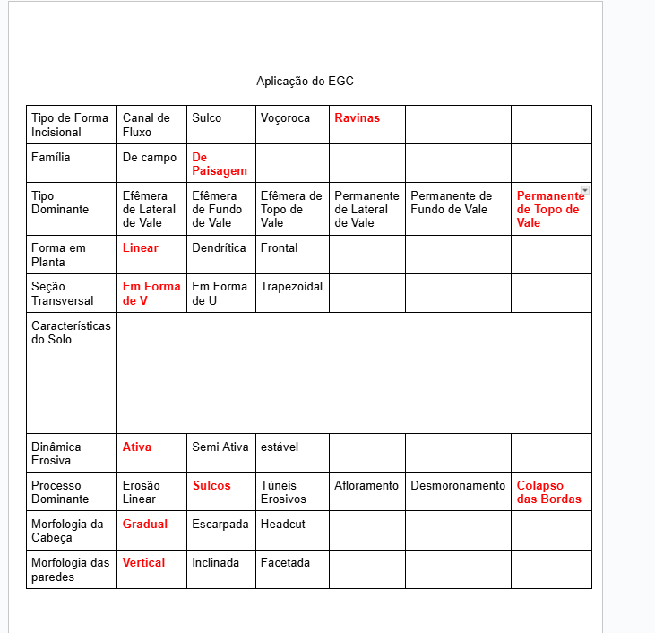
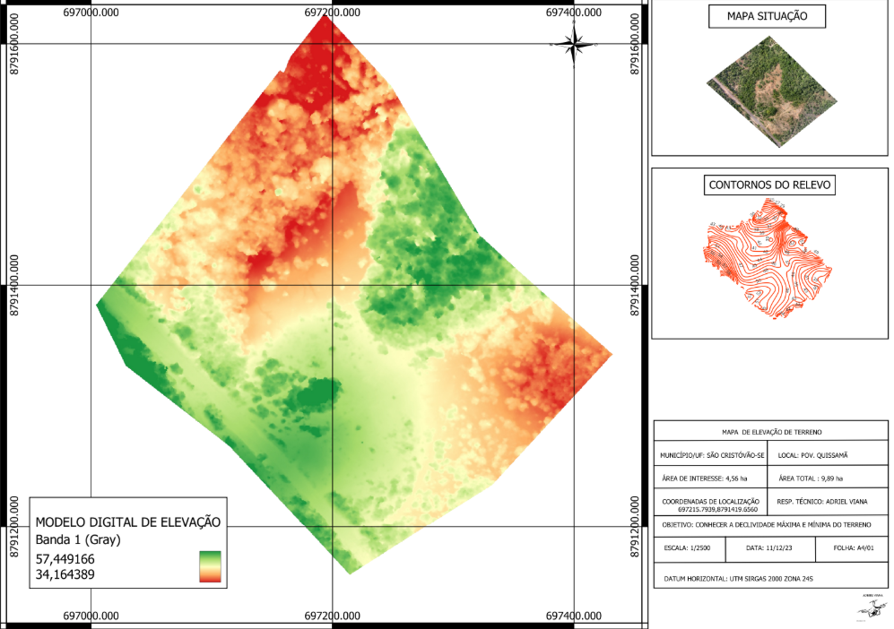
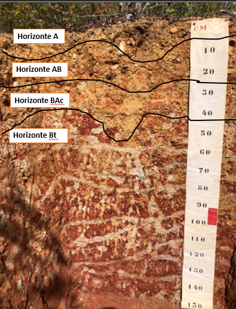

---
title: "Tipificação de processos erosivos em Plintossolo em área de tabuleiros costeiros no Nordeste do Brasil"
author: Emersson Guedes da Silva.
date: "25 de dezembro de 2025"
bibliography: ../referencias_artigos.bib
lang: pt-BR
---

# Resumo

A caracterização dos eventos erosivos que orientam a sua classificação não é consensual, principalmente pela confusão que se criou sobre os conceitos de ravinas e voçorocas. Grande parte dos estudos apresentam definições indistintas entre a tipificação de ravinas e voçorocas, com enfoque para estudos de caso sobre seu processo evolutivo e possíveis formas de estabilização. O objetivo desse trabalho foi realizar classificação de processos erosivos segundo a The Elementary Gully Classification (EGC), analisando as causas e potenciais formas de prevenção e controle da erosão. A classificação das feições erosivas foi realizada na área da Estação Experimental Campus Rural da Universidade Federal de Sergipe (UFS), localizada no Município de São Cristóvão, no Nordeste do Brasil, utilizando o método EGC. A metodologia empregada envolveu a análise de imagens da área, abrangendo o período de 2007 a 2023, a caracterização do perfil do solo com suas propriedades físicas e químicas, a mensuração da taxa de infiltração básica e a análise morfométrica das feições erosivas, incluindo profundidade, largura e comprimento. As características predominantes identificadas segundo a EGC, como a morfologia em V, a presença de material argiloso coesivo e a atividade contínua dos processos erosivos, indicam um estágio evolutivo avançado, classificando-as como voçorocas (ou ravinas, na terminologia brasileira). Entretanto, o método da EGC não apresenta uma distinção clara entre esses dois tipos de feições. As feições estudadas apresentam características intermediárias entre ravinas e voçorocas, sugerindo a necessidade de adaptações na classificação para abranger a diversidade de feições erosivas identificadas em campo, considerando características mais detalhadas como comprimento e clima local, de modo a reduzir exclusões por critério.

**Palavras-chave** Classificação, feições erosivas, ravinas, voçorocas

# 1. Introdução

A dinâmica erosiva hídrica opera fundamentalmente como resposta integrada entre o comportamento hidrológico do solo, propriedades estruturais do material edáfico e regimes pluviométricos regionais. Em solos tropicais com horizonte argiloso impeditivo e baixa condutividade hidráulica, como Plintossolos, a infiltração reduzida conduz à rápida geração de escoamento superficial concentrado que, canalizando-se sob declividades moderadas a altas, origina feições erosivas lineares cuja progressão evolutiva, de sulcos a ravinas e potencialmente a voçorocas, reflete a intensificação dos processos de incisão regressiva e instabilidade de taludes. A vulnerabilidade edáfica desses solos a processos erosivos encontra respaldo em estudos conduzidos em regiões em desenvolvimento [@kuhn_et_al_2023], onde Xiong et al. [@xiong_et_al_2024] projetam incrementos de 6,8% a 11,3% na magnitude de erosão hídrica até 2090.

Nos Tabuleiros Costeiros do Nordeste brasileiro, donde se reconhece a predominância de Plintossolos com elevada fração argilosa e baixa permeabilidade, a incidência de ravinas e voçorocas constitui indicador crítico de degradação territorial, especialmente quando originadas por intervenções antrópicas não sustentáveis sobre drenagem e cobertura vegetal. A diferenciação clara entre essas feições, porém, permanece consensualmente frágil, como observam Kumar et al. [@kumar_et_al_2020], para quem as voçorocas são depressões contínuas em superfícies inclinadas originadas pelo deslocamento do solo sob escoamento superficial, enquanto Amare et al. [@amare_et_al_2019] e Frankl et al. [@frankl_et_al_2021] distinguem categorias transitórias (voçorocas de fundo de vale versus encosta, e voçorocas efêmeras em fluxo concentrado de recorrência elevada) que refletem graus diferentes de consolidação morfológica e conectividade hidrológica.

A distinção terminológica entre ravinas e voçorocas, conquanto semanticamente estabelecida em literatura, carece de operacionalidade empírica quando aplicada a ambientes tropicais sob constrições edáficas agudas. Rashmi et al. [@rashmi_et_al_2021] e Mohapatra [@mohapatra_2022] registram o uso indiscriminado de ambos os termos, enquanto Ganerod et al. [@ganerod_et_al_2023] ressaltam que fluxo permanente versus intermitente, e respostas ao fluxo subsuperficial, constituem dimensões relevantes que transcendem categorias morfométricas simples. Evidencia-se, portanto, necessidade de arcabouço classificatório estruturado, multidimensional e sensível a particularidades regionais, demanda que orienta o presente trabalho.

O estudo de Thwaites et al. [@thwaites_et_al_2022] propôs The Elementary Gully Classification (EGC), sistema que integra atributos posicionais (topo de vale, encosta, fundo de vale), morfodinâmicos (ativo versus inativo), geométricos (forma em planta, seção transversal, tipo de cabeça) e de profundidade, objetivando padronização e precisão nas estratégias de manejo. Essa ferramenta mostrou-se promissora em ambientes temperados e semiáridos, porém sua aplicabilidade em Plintossolos de Tabuleiros Costeiros permanece pouco explorada, sobretudo quanto à sua sensibilidade às condições de baixa infiltração, respostas sazonais acentuadas de saturação e processos de cisalhamento em taludes argilosos coesos.

Concomitantemente, o mapeamento multitemporal de alta resolução, viabilizado por sistemas aéreos não tripulados (UAVs) e processamento fotogramétrico, permite aquisição de métricas morfométricas precisas e rastreabilidade temporal de mudanças morfológicas, reduzindo ambiguidades que tradicionalmente acompanharam a classificação de feições em trabalhos de erosão. Modelos digitais de elevação multitemporais demonstram capacidade para avaliar mudanças volumétricas e trajetórias evolutivas em ravinas [@raj_et_al_2022; @ghosh_et_al_2022; @jinger_et_al_2022; @wilkinson_et_al_2024].

Portanto, o objetivo deste trabalho foi empregar a classificação EGC para tipificar ravinas desenvolvidas em Plintossolo de Tabuleiro Costeiro, integrando caracteres morfométricos de alta resolução, atributos edáficos detalhados (granulometria, química, infiltração) e regime pluviométrico regional, a fim de esclarecer o estágio evolutivo das feições, seus mecanismos condicionantes e limitações da EGC em contextos tropicais com solos impermeáveis.

# 2. Materiais e métodos

## 2.1. Caracterização da área de estudo

O estudo foi conduzido em uma área localizada no povoado Timbó, município de São Cristóvão (-10.927923° de latitude; -37.195820° de longitude), a aproximadamente 22,3 km de Aracaju, capital do estado de Sergipe, na região Nordeste do Brasil. A área está inserida na unidade geomorfológica dos tabuleiros costeiros, pertencentes ao Grupo Barreiras, que correspondem a cerca de 32% da superfície estadual [@azambuja_missura_araujo_2024].

A localidade apresenta clima tropical úmido com estação seca bem definida e chuvas concentradas no inverno (As), predominantemente entre os meses de abril e setembro [@duarte_santos_castelhano_2021]. Os solos dominantes são classificados como Neossolo Flúvico Psamítico, Argissolo Vermelho-Amarelo Distrófico e Plintossolo Háplico Distrófico [@nascimento_pedrotti_2004].

O relevo regional apresenta-se diversificado, com predominância de superfícies planas a suavemente onduladas e ocorrência de áreas onduladas. No local de estudo, predomina o relevo ondulado a muito ondulado.

Espacialmente, a delimitação da área e o entorno imediato evidenciam a predominância do relevo ondulado a muito ondulado e a convergência de escoamento em linhas preferenciais sob a topografia local (Fig. 1).

{width="4.4in" height="3.1in"}

## 2.2. Classificação do solo

A identificação e classificação do perfil edáfico foi realizada segundo os protocolos do Sistema Brasileiro de Classificação de Solos (SiBCS) [@embrapa_2018], com base em caracterização morfológica conforme Tomé Júnior [@tome_junior_1997]. Para geração de base diagnóstica representativa das propriedades do Plintossolo junto às feições erosivas, procedeu-se à abertura de trincheira com dimensões de 1,5 m de profundidade, 1,5 m de comprimento e 1,0 m de largura, permitindo descrição detalhada de cor, textura, estrutura, consistência e demais atributos morfológicos de cada horizonte. Amostras foram submetidas a análises físicas (granulometria por pipeta e densimetria) e químicas (pH em água 1/2,5; cátions trocáveis Al³⁺, K⁺, Ca²⁺, Mg²⁺ por extração com KCl 1 mol/L; fósforo disponível e carbono orgânico por método de Walkley-Black), fundamentando a classificação taxonômica.

A Velocidade de Infiltração Básica (VIB), parâmetro crítico para a avaliação da suscetibilidade erosiva ao longo da vertente, foi determinada mediante o método de infiltrômetro de anéis concêntricos descrito por Bernardo et al. [@bernardo_et_al_2008]. Utilizou-se equipamento composto por dois anéis de diâmetros 20 cm (interno) e 40 cm (externo), com altura de 15 cm, instalados no solo em três pontos estratificados (terço superior, médio e inferior da feição) a fim de capturar a variação de infiltração ao longo da rampa em resposta aos gradientes de textura e coesão. Após estabilização (período de submersão inicial), registrou-se a altura de água necessária para manter lâmina constante em intervalos de tempo regulares, permitindo quantificar a taxa de descida da frente de molhamento e, por conseguinte, a capacidade de infiltração efetiva do solo sob condicionalidades saturadas. Para fins de síntese, a VIB em cada posição foi estimada como a média das cinco últimas leituras da série temporal do ensaio, utilizando a velocidade média expressa em cm/h.

## 2.3 Morfologia e caracterização topográfica da ravina

A aquisição de dados geoespaciais de alta resolução foi conduzida mediante sistema aéreo não tripulado (Unmanned Aerial Vehicle, UAV) modelo DJI Phantom 4 PRO (SZ DJI Technology Co., Ltd., Shenzhen, China), capaz de gerar ortomosaicos com resolução espacial de 1 m e nuvem de pontos densa. Dois voos fotogramétricos foram planejados com sobreposição longitudinal de 80% e lateral de 60%, abrangendo aproximadamente 5 hectares da área e seu entorno imediato, região onde ocorrem sulcos, ravinas e voçorocas. O processamento fotogramétrico para geração do Modelo Digital de Elevação (MDE) e nuvem de pontos foi realizado no software Agisoft Metashape Professional Edition 1.6 (versão de avaliação).

A avaliação morfométrica das incisões erosivas consistiu em mensuração de largura (topo, média e base), comprimento total ao longo da rampa e profundidade nas seções superior, média e inferior de cada feição, desde suas margens iniciais até o leito mais profundo. Para contextualização temporal da evolução morfológica, foi conduzida análise multitemporal comparando imagens de satélite e ou ortofotos disponíveis em base aberta, por exemplo Google Earth, cobrindo o período de 2007 a 2023 (16 anos), permitindo rastreamento de alterações em cobertura vegetal e área de solo exposto. Seis incisões erosivas foram identificadas e medidas sistematicamente na área.

## 2.4 Classificação dos processos erosivos

A tipificação das incisões erosivas conforme The Elementary Gully Classification (EGC) proposta por Thwaites et al. [@thwaites_et_al_2022] foi operacionalizada seguindo a sequência decisória que considera posicionamento na paisagem, grau de atividade, forma em planta, geometria da seção transversal, tipo de cabeça erosiva e classes de profundidade. O enquadramento foi fundamentado na integração de medidas morfométricas de campo, interpretação visual de ortomosaicos de alta resolução (1 m) e análise de Modelo Digital de Elevação derivado do processamento fotogramétrico, permitindo inferência da organização espacial das feições, padrões de convergência de escoamento superficial e potencial conectividade hidrológica.

A caracterização climática do regime de chuvas foi obtida a partir de série diária de precipitação agregada para o período de 2005 a 2025 no município de São Cristóvão (n=7.305 dias), transformada em climatologia mensal visando identificar as janelas sazonais de maior propensão à geração de escoamento concentrado e, em decorrência, à intensificação de erosão linear sob as condicionantes edáficas pré-existentes.

## 2.5 Integração processo, solo e morfometria com suporte estatístico

Para reduzir o caráter estritamente descritivo da tipificação e suportar a inferência de mecanismos, definiu-se um protocolo analítico que integra variáveis morfométricas em uma matriz feição por atributo, contendo largura, profundidade e comprimento em três segmentos. A base morfométrica foi consolidada a partir de planilha de campo com as seis feições inventariadas, permitindo derivar profundidade máxima por feição, largura média por feição e estimativa de volume mobilizável por aproximação geométrica de seção trapezoidal. Em função do tamanho amostral limitado pelo número de feições disponíveis, a abordagem multivariada é tratada como ordenação exploratória, com padronização das variáveis em escala comparável e interpretação físico-hidrológica do gradiente dominante, prática alinhada a sínteses recentes que recomendam integrar métricas geomorfológicas e controles de processo ao estudo de ravinas e voçorocas [@poesen_2018; @dey_et_al_2018].

As relações monotônicas entre variáveis foram avaliadas por correlação não paramétrica, adequada quando normalidade e homocedasticidade não podem ser assumidas com segurança. Para expressar de modo parcimonioso a dependência da profundidade máxima em relação a controles geométricos, foi ajustado um modelo linear com comprimento e largura média como preditores, com inspeção de resíduos e interpretação restrita ao caráter exploratório do conjunto amostral. A ordenação multivariada foi representada por análise de componentes principais aplicada à matriz padronizada de comprimento, largura média e profundidade máxima, reportando variância explicada e cargas, conforme recomendações de sínteses sobre processos e modelagem de erosão em ravinas [@dey_et_al_2018; @dagar_2018].

[🔴 GAP CRÍTICO. A VIB foi quantificada por posição na vertente, o que sustenta a interpretação hidrológica como condição de contorno, porém a evidência ainda é insuficiente para modelagem feição a feição do controle de infiltração sobre profundidade e volume, uma vez que faltam séries completas por feição e por segmento e não há medidas de condutividade hidráulica saturada.]

# 3. Resultados e discussão

## 3.1 Tipificação das feições erosivas segundo a Elementary Gully Classification (EGC)

A aplicação sistemática da chave de classificação EGC resultou no enquadramento de seis incisões erosivas segundo atributos morfométricos, morfodinâmicos e posicionais integrados. A Fig. 2 estrutura o fluxo decisório abrangendo posicionamento na paisagem, grau de atividade, forma em planta, geometria da seção transversal, tipo de cabeça erosiva e profundidade. Três feições apresentaram estrutura suficiente para classificação completa; destas, a Feição 1 caracteriza-se como composta/digitada com múltiplas ramificações em topo de vale, enquanto as Feições 4 e 5 enquadram-se como lineares também em topo de vale (Tab. 1). Todas as feições foram classificadas como permanentes e ativas, indicador de consolidação morfológica já estabelecida sem potencial de recuperação por simples nivelamento superficial.

Do ponto de vista hidrossedimentológico, a tipificação por si só descreve a geometria, porém a persistência de feições ativas em Plintossolos é condicionada pela interação entre infiltração efetiva, geração de escoamento concentrado e a relação entre a tensão cisalhante imposta pelo fluxo e a resistência ao destacamento do material edáfico. Em materiais argilosos coesos, a resistência à erosão e a estabilidade relativa de taludes secos podem mascarar a progressão incisional até que a saturação eleve pressões neutras e reduza tensões efetivas, acelerando instabilidade de taludes e alargamento, processo compatível com a literatura sobre resistência à erosão em ravinas e mecanismos de erosão hídrica [@lafayette_cantalice_coutinho_2011; @firoozi_firoozi_2024].

Tabela 1. Síntese tipológica das feições erosivas segundo a EGC

| Feição | Posição na paisagem | Atividade erosiva | Forma em planta | Seção transversal | Tipo de cabeça | Profundidade |
|---:|---|---|---|---|---|---|
| 1 | Topo de vale | Ativa | Composta / digitada (ramificada) | Em "U" | Vertical / escarpada | Rasa a tendendo a profunda (aprox. 1,2--1,5 m) |
| 4 | Topo de vale | Ativa | Linear | Em "V" | Vertical | Rasa a moderadamente profunda (aprox. 1,0--1,3 m) |
| 5 | Topo de vale | Ativa | Linear | Em "V" | Vertical / escarpada | Profunda (aprox. 1,5 m) |

Fonte Autores, com base na Elementary Gully Classification (EGC) [@thwaites_et_al_2022].

{width="4.0in" height="3.9in"}

A atividade erosiva foi confirmada pela observação em campo de cabeças bem definidas e abruptas, taludes desprovidos de cobertura vegetal efetiva, e evidências de recuo regressivo documentadas na análise multitemporal ao longo de 16 anos (2007–2023), conforme ilustrado na Fig. 3. A persistência dessas características reforça o enquadramento das ravinas como feições em estágio incipiente, porém ativo, de evolução, sem sinais de transição para condições vegetadas ou parcialmente inativas.

Quanto à forma em planta, observou-se predominância de geometria linear, com exceção da Feição 1 que exibe conformação dendrítica com ramificações laterais. Esse padrão reflete atuação combinada entre incisão vertical e erosão lateral sob baixa infiltração efetiva e elevada conectividade hidrológica superficial, processo típico de Plintossolos onde divergência e reconvergência de escoamento ocorrem sob topografia complexa e propriedades físicas variáveis da vertente.

A seção transversal predominante foi em "V" (Tab. 1), geometria que reflete maior coesão dos materiais constituintes em profundidade. Segundo a EGC, tais perfis são característicos de solos com elevada fração argilosa e estrutura consolidada em camadas subsuperficiais, condição plenamente coerente com o Plintossolo Argilúvico Distrófico identificado na área. Perfis em V indicam estágio inicial de evolução, podendo transitar para geometrias trapezoidais ou em U conforme intensificação da erosão lateral sob aumento da energia do escoamento ou redução da coesão dos taludes. A Feição 1, por seu turno, apresenta seção em "U" na base de seus braços dendríticos, coerente com processo de alargamento já em curso sob energia elevada de fluxo.

No enquadramento mecanístico, o perfil em V é compatível com dominância de incisão vertical sob escoamento concentrado, enquanto a transição local para seção em U indica intensificação do colapso de taludes e do retrabalhamento lateral em episódios de saturação, com perda de resistência ao cisalhamento por redução de tensão efetiva e aumento de erosão por destacamento nas margens. Esse comportamento é coerente com sínteses que descrevem a evolução de ravinas como resposta não linear entre energia do escoamento, resistência do solo e instabilidade de taludes [@sidorchuk_2006; @dey_et_al_2018].

O tipo de cabeça erosiva predominante foi vertical ou escarpada, especialmente nas feições de maior profundidade (Tab. 1), evidenciando recuo regressivo expressivo por desprendimento localizado e cisalhamento em profundidade. Feições de menor profundidade apresentam cabeças menos abruptas, associadas a estágios iniciais de incisão. A presença de cabeças verticais reforça o caráter ativo das ravinas e sinaliza potencial de avanço a montante sob eventos pluviométricos recorrentes, especialmente no período de maio a agosto quando saturação antecedente elevada reduz infiltração efetiva.

A profundidade variou de rasa (Feição 2, 0,4 m) a profunda (Feição 5, 1,5 m), permanecendo abaixo dos 3 m que a EGC estabelece como limiar inferior para classificação como voçoroca. Não obstante, a evolução regressiva ativa, ausência de cobertura vegetal estabilizadora e declividades de 7% a 24% ao longo da rampa (Fig. 5) indicam elevada suscetibilidade à progressão morfométrica futura sob intensificação de chuvas extremas. Nesse contexto, a implantação de barreiras permeáveis do tipo paliçada opera como alternativa de baixo custo para reduzir conectividade hidrossedimentológica, dissipar energia da enxurrada e promover deposição preferencial de sedimentos a montante, contribuindo para estabilização progressiva do fundo e taludes [@lucas_borja_et_al_2021; @guerra_bezerra_jorge_2023].

## 3.2 Caracterização morfométrica e edáfica integrada

A quantificação morfométrica realizada em campo revelou variabilidade espacial acentuada das feições erosivas ao longo da vertente. Dos dados coletados (Figura 3), a Feição 2 apresenta a menor profundidade (0,4 m), enquanto a Feição 5 atinge a profundidade máxima (1,5 m), intervalo que se alinha às classes rasa e profunda da EGC. A profundidade máxima situa-se predominantemente no terço intermediário de cada incisão, coincidindo com o terço médio da rampa onde declividades entre 8% e 17% amplificam tensão cisalhante do escoamento. De forma comparativa, Martins et al. [@martins_et_al_2024], ao analisarem 38 ravinas em ambiente mediterrâneo, registraram comprimentos significativamente maiores, porém em relação à largura, padrão semelhante foi observado (1–2 m em ambos os estudos). A EGC não estabelece critérios classificatórios baseados explicitamente em largura e comprimento absolutos, limitação que compromete a distinção entre contextos climáticos e geológicos distintos.

{width="5.0in" height="2.4in"}

Quantitativamente, a profundidade máxima apresentou associação positiva com comprimento, com correlação de Spearman igual a 0,70 e p igual a 0,188 em cinco feições com comprimento disponível, enquanto a relação entre profundidade máxima e largura média indicou tendência inversa, com correlação de Spearman igual a -0,667 e p igual a 0,148 em seis feições. Em termos de massa mobilizável, a estimativa de volume por aproximação de seção trapezoidal variou de 6,400 m³ a 56,110 m³ nas cinco feições com comprimento registrado, e a correlação de Spearman entre volume e profundidade máxima foi igual a 0,90 com p igual a 0,037, resultado coerente com a dominância de profundidade como amplificador geométrico da área de seção. A análise de componentes principais aplicada à matriz padronizada de comprimento, largura média e profundidade máxima retém 0,649 da variância no primeiro componente e 0,297 no segundo, sugerindo que o principal gradiente geométrico é governado pela co-variação entre comprimento e profundidade, com contribuição adicional de largura na separação das feições em segundo eixo, interpretação consistente com discussões que tratam a evolução de ravinas como resposta integrada entre incisão, alargamento e instabilidade de taludes [@sidorchuk_2006; @dey_et_al_2018].

Em ajuste linear parcimonioso com cinco feições completas, a profundidade máxima estimada em função de comprimento e largura média resultou em R² ajustado igual a 0,438, com coeficiente de comprimento igual a 0,028 m por metro e p igual a 0,223, enquanto o coeficiente de largura média foi igual a -1,180 m por metro com p igual a 0,342, reforçando que a evidência estatística deve ser interpretada como exploratória no contexto de amostra reduzida e de alta colinearidade geométrica entre variáveis derivadas.

Em complemento, uma verificação exploratória com VIB consolidada em planilha de campo para feições com réplicas disponíveis indicou correlação de Spearman igual a -0,632 entre VIB e profundidade máxima, com p igual a 0,368 em quatro feições, resultado que deve ser lido como indicativo preliminar, sensível a heterogeneidade entre réplicas e à amostra reduzida.

A caracterização edáfica revelou Plintossolo Argilúvico Distrófico composto por quatro horizontes (A, AB, BAc, Bt) com propriedades físicas e químicas progressivamente mais restritivas em profundidade (Tab. 2). Horizontes subsuperficiais (BAc, Bt) exibem textura argilosa (49,2% e 51,4% de argila respectivamente), conferindo maior plasticidade e pegajosidade sob saturação. O pH muito ácido (4,5–4,6 nas camadas subsuperficiais) associado a elevada concentração de alumínio trocável (3,7–5,9 cmolc/dm³) e baixa saturação por bases (9,5–13,6%) constitui fator edáfico fundamental que prejudica agregação estrutural e estabilidade de taludes, aumentando suscetibilidade ao cisalhamento sob escoamento concentrado.

Em termos de mecânica de solos, a elevação de umidade nos horizontes argilosos subsuperficiais tende a reduzir a resistência ao cisalhamento por aumento de pressões neutras e diminuição de tensão efetiva, o que favorece instabilidade progressiva de taludes e recuo de cabeceira durante a estação úmida. A acidificação e a baixa saturação por bases limitam o desenvolvimento de cobertura vegetal e reforço radicular, reduzindo a armadura biológica e ampliando a exposição do material edáfico ao regime de escoamento concentrado, mecanismo relevante em discussões sobre fragilidade intrínseca e vulnerabilidade de solos tropicais [@cassol_et_al_2023; @firoozi_firoozi_2024].

TABELA 2 - Atributos químicos e físicos do Plintossolo Argilúvico distrófico

| Atributos | Ap | AB | BAc | Bt |
|---|---:|---:|---:|---:|
| pH em água (1/2,5) | 5,2 | 4,5 | 4,6 | 4,6 |
| P (Fósforo) -- mg/dm^3^ | 1,4 | 1,4 | 1,4 | 1,4 |
| K (Potássio) -- mg/dm^3^ | 82,1 | 17,0 | 6,5 | 5,6 |
| Al (Alumínio) -- cmol~c~/dm^3^ | 0,56 | 2,9 | 3,7 | 5,9 |
| T (CTC a pH 7,0) -- cmol~c~/dm^3^ | 5,3 | 4,1 | 4,4 | 7,9 |
| M (Saturação por Alumínio) - % | 15,2 | 89,8 | 99,2 | 84,7 |
| V (Saturação por Bases) - % | 58,4 | 14,5 | 9,5 | 13,6 |
| Areia - % | 51,5 | 43,6 | 43,5 | 39,65 |
| Silte - % | 14,9 | 8,9 | 7,5 | 8,9 |
| Argila - % | 33,4 | 47,4 | 49,2 | 51,4 |
| Textura | Franco argilo-arenosa | Argilosa | Argilosa | Argilosa |

Fonte Autores

Com exceção do horizonte A de textura média, os demais apresentam textura argilosa a muito argilosa, elevada plasticidade e pegajosidade, características que resultam em maior coesão quando secos porém menor condutividade hidráulica quando úmidos. Essas condições edáficas favorecem a deflagração de processos erosivos lineares sob precipitação acima da infiltração efetiva, pois a baixa permeabilidade intrínseca concentra escoamento superficial em canais preferenciais. A baixa cobertura vegetal presente na área, predominantemente arbustiva-arbórea com espécies de folhas coriáceas, reflete a fertilidade restrita, refletindo elevados teores de alumínio e pH muito ácido, padrão consistente com discussões em De Oliveira et al. [@de_oliveira_et_al_2024] e Cassol et al. [@cassol_et_al_2023] acerca da suscetibilidade de Plintossolos à erosão linear.

Velocidade de Infiltração Básica (VIB) no Plintossolo evidenciou gradiente hidrológico ao longo da vertente, com estimativas de 3,126±0,139 cm/h no terço superior, 1,527±0,140 cm/h no terço intermediário e 1,585±0,047 cm/h no terço inferior, valores calculados como média das cinco últimas leituras de cada ensaio. Esse padrão é consistente com redução de infiltração efetiva associada a acúmulo de finos e compactação relativa no terço basal. Esses valores alinham-se com observações de Patle et al. [@patle_et_al_2019] em solos indianos, onde infiltração foi significativamente menor em solos areno-francos (0,30–13,80 cm/h) em comparação com franco-arenosos, demonstrando correlação negativa entre fração argilosa e taxa de infiltração. A baixa VIB integrada ao regime sazonal de chuvas (seção 3.4) confere ao Plintossolo vulnerabilidade crítica à saturação superficial e geração rápida de enxurrada, especialmente em declividades moderadas.

O gradiente de infiltração observado ao longo da vertente indica que o controle hidrológico não se restringe à geração de enxurrada superficial, pois também condiciona armazenamento temporário de água e possíveis fluxos de exfiltração em descontinuidades texturais ou estruturais. Em Plintossolos, a presença de horizontes de baixa condutividade hidráulica pode induzir formação de lençol suspenso e retorno de fluxo próximo à superfície, ampliando conectividade hidrológica e a persistência de áreas saturadas durante eventos recorrentes.

Morfologicamente, cabeças verticais e padrões digitados indicam recuo regressivo e concentração de energia na cabeceira, além de potencial contribuição de instabilidade de taludes sob saturação antecedente (Fig. 4).

{width="6.0in" height="2.9in"}

Topograficamente, a variabilidade de declividades e a convergência do relevo sustentam trajetórias preferenciais de escoamento superficial concentrado, modulando a distribuição espacial de tensão cisalhante ao longo da rampa (Fig. 5).

{width="6.0in" height="4.2in"}

Posicionalmente, o enquadramento das feições em topo de vale reforça o papel de áreas de convergência como focos de geração de enxurrada e início de incisão sob baixa infiltração (Fig. 6).

{width="4.0in" height="3.9in"} 

Pedogeneticamente, o perfil evidencia a compartimentação de horizontes e a presença de camadas argilosas que podem operar como impedimento hidráulico e gatilho para saturação antecedente, com implicações diretas para estabilidade de taludes (Fig. 7).

{width="2.3in" height="2.8in"}

## 3.4 Dinâmica hidrológica e controle sazonal da atividade erosiva

Os episódios de mobilização máxima de sedimentos ao longo da rampa ocorrem quando intensidade de precipitação ultrapassa a infiltração efetiva do perfil, elevando escoamento superficial concentrado e, por conseguinte, tensão cisalhante atuante no fundo e taludes. No Plintossolo de estudo, a baixa permeabilidade intrínseca associada aos horizontes argilosos e caráter hidromórfico condiciona saturação superficial e rápida geração de enxurrada, de tal forma que eventos de chuva recorrentes sustentam conectividade hidrossedimentológica elevada sob declividades de 7–24% (Fig. 5).

Além do regime de escoamento superficial, a interpretação mecanística em solos com camadas de baixa condutividade hidráulica requer distinguir erosão por overland flow, associada ao excedente de precipitação sobre a infiltração efetiva, de processos subsuperficiais potencialmente relevantes, como piping e sapping, que se manifestam quando a água circula em descontinuidades e emerge em faces expostas, removendo material internamente e favorecendo colapsos localizados. Embora a tipificação EGC descreva forma e posição, a identificação desses mecanismos depende de evidências de exfiltração, cavidades, colapsos em túnel e padrões de instabilidade que não são explicitamente contemplados na chave, limitação recorrente em discussões sobre processos e modelagem de ravinas [@dey_et_al_2018; @dagar_2018].

A série temporal de precipitação do período 2005–2025 (7.305 dias registrados) revelou padrão sazonal acentuado na região. A climatologia mensal evidencia máxima em maio (164,7 mm), seguida por abril (145,7 mm) e junho (141,5 mm), enquanto novembro (43,9 mm) e outubro (49,1 mm) constituem o período de menor aporte hídrico (Fig. 8). Essa distribuição sazonal extrema amplifica a frequência de estados antecedentes úmidos entre abril e agosto, período em que saturação de camadas superficiais reduz infiltração efetiva a valores críticos (<2 cm/h no terço inferior) e favorece incisão regressiva e instabilidade de taludes. A magnitude dessa variação climática é particularmente pertinente em Plintossolos, onde a capacidade de retenção de água aumenta em profundidade [@wang_et_al_2020], levando a acumulação de umidade em horizontes subsuperficiais durante a estação úmida e amplificando potencial de colapso geotécnico por saturação.

A análise comparativa de VIB indicou redução acentuada do terço superior para os segmentos médios e inferiores, com 3,126±0,139 cm/h no terço superior, 1,527±0,140 cm/h no terço intermediário e 1,585±0,047 cm/h no terço inferior, valores calculados como média das cinco últimas leituras de cada ensaio. Esses valores alinham-se com observações de Bajirao e Vishnu [@bajirao_vishnu_2023], que registraram 1,15–1,36 cm/h em solos compactados ou áridos, intervalo próximo ao observado na porção intermediária e inferior, sugerindo que degradação estrutural por erosão lateral prévia reduziu capacidade de infiltração a patamares críticos. A presença de horizontes plínticos e elevada fração argilosa conferem menor permeabilidade ao solo, favorecendo formação de áreas de encharcamento em camadas superficiais onde escoamento tende a se concentrar em canais de fluxo preferenciais sob eventos pluviométricos moderados a intensos.

Esses mecanismos hidrológicos, integração de baixa VIB, regime sazonal extremo, elevada conectividade hidrossedimentológica e declividades moderadas, relacionam-se diretamente com a atividade erosiva ativa documentada nas feições classificadas pela EGC. O entendimento da dinâmica da água no solo não apenas caracteriza as causas dos processos erosivos, mas também subsidia a definição de práticas de conservação e controle adequadas para a realidade dos Plintossolos em Tabuleiros Costeiros, orientando decisões de alocação e priorização de intervenções estruturais como barreiras permeáveis.

{width="6.0in" height="2.6in"}

## 3.5 Limitações operacionais da EGC em Plintossolos de Tabuleiros Costeiros

Embora a Elementary Gully Classification tenha se mostrado eficaz para enquadramento morfológico das feições erosivas, sua aplicação em ambientes tropicais sobre Plintossolos revela limitações operacionais importantes. A principal delas refere-se à ausência de critérios explícitos para diferenciação de ravinas e voçorocas em contextos onde progressão evolutiva é condicionada por fatores edáficos (plinticidade, conteúdo de alumínio trocável, coesão) e climáticos (sazonalidade extrema, intensidade de eventos extremos) específicos.

Em termos de processo, a rigidez classificatória torna-se mais crítica quando a evolução morfológica é governada por alternância entre estados secos, com maior resistência aparente do material, e estados úmidos, quando a redução de tensão efetiva favorece instabilidade e acelera alargamento. Essa alternância é amplificada em Plintossolos por impedimento hidráulico e saturação antecedente, de modo que feições com profundidade abaixo de 3 m podem apresentar dinâmica funcional comparável a voçorocas em termos de conectividade hidrossedimentológica, conforme discutido em sínteses sobre necessidades de pesquisa em erosão e lacunas de classificação de feições [@poesen_2018; @thwaites_et_al_2022].

No contexto brasileiro, é amplamente aceita a concepção de evolução contínua entre sulcos, ravinas e voçorocas. As feições analisadas neste trabalho apresentam características intermediárias, evidenciando necessidade de incorporação de parâmetros adicionais, comprimento total, regime pluviométrico sazonal e estágio de estabilização vegetal, que traduzam o regime hidrológico e a estabilidade geotécnica do material edáfico. A distinção clássica brasileira enfatiza persistência temporal da feição, aprofundamento e alargamento associados à instabilidade de taludes, enquanto a EGC prioriza padronização morfológica e posicional que pode ser insensível a condicionantes tropicais como plinticidade, variações rápidas de saturação e respostas hidrossedimentológicas altamente sazonais. A robustez da aplicação de EGC em Plintossolos de Tabuleiros Costeiros é portanto maximizada quando acompanhada de métricas que integrem regime hidrológico, propriedades geotécnicas e sazonalidade climática regional.

Para aumentar a operacionalidade e reduzir ambiguidades, a aplicação da EGC pode ser complementada por indicadores quantitativos que expressem o regime hidrológico e a suscetibilidade edáfica, incluindo VIB como proxy de geração de enxurrada, declividade como proxy de energia disponível ao escoamento e atributos do perfil que modulam estabilidade de taludes e cobertura vegetal. A integração dessas variáveis em rotinas multivariadas e modelos parcimoniosos, conforme descrito na seção de métodos, desloca a discussão do rótulo morfológico para o mecanismo dominante e para a implicação de manejo, estratégia compatível com discussões sobre prevenção e controle de ravinas que enfatizam eficiência operacional e adequação de intervenção ao processo [@frankl_et_al_2021; @dagar_2018].

# 4. Conclusões

A aplicação da classificação EGC possibilitou identificação de características morfométricas relevantes (geometria em "V", material argiloso coeso, atividade contínua) fornecendo indicativos sobre estágio evolutivo das feições e permitindo correlação com literatura internacional. Entretanto, ausência de diferenciação clara entre ravinas e voçorocas limita precisão do enquadramento quando se busca regionalização dos termos em ambientes tropicais. As feições estudadas apresentam características intermediárias entre ambas as categorias, sinalizando necessidade de incorporação de parâmetros sensíveis às particularidades regionais, incluindo comprimento, condições climáticas sazonais e critérios menos excludentes. Os resultados reforçam importância de considerar estágios de desenvolvimento das feições, características edáficas detalhadas e condicionantes climáticos locais para alcançar classificação mais precisa e funcional de processos erosivos lineares em Plintossolos.

No nível de processo, a interpretação em Plintossolos é fortalecida quando o enquadramento morfológico é acompanhado por leitura hidrológica e geotécnica da vertente, distinguindo dominância de overland flow de possíveis contribuições subsuperficiais e reconhecendo o papel da saturação antecedente na redução de tensão efetiva e na instabilidade de taludes. A consolidação do protocolo estatístico proposto permite testar a associação entre VIB, atributos do perfil e métricas de incisão, ancorando a discussão em evidência quantitativa e apoiando decisões de manejo baseadas em indicadores.

# Referências

::: {#refs}
:::

